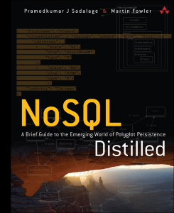

<!--
  bespokeEvent: bullets.disable
-->

# NoSQL

_Professor:_ [Daniel Hasan Dalip - hasan@decom.cefetmg.br](mailto:hasan@decom.cefetmg.br)

_Slides:_ Prof. Flávio Coutinho

---
# Aulas
- Aula 1 (30/08/2017): [Introdução a NoSQL](classes/intro/)
- Aula 2 (06/09/2017):
  - 18:50 - 20:30: [Teoria (Distribuição, CAP, _Map-Reduce_) (1ª parte)](classes/theory/)
  - 20:50 - 22:30: [Teoria (Distribuição, CAP, _Map-Reduce_) (2ª parte) ](classes/theory/#25)
- Aula 3: (13/09/2017)
  - 18:50 - 20:30: [_Document Stores_](classes/document/)
  - 20:50 - 22:30: [Prática 1 MongoDB][activity-mongodb1]
- Aula 4: (20/09/2017)
  - 18:50 - 20:30: _Document Stores_([restim](classes/document/#47))
  - 20:50 - 22:30:  [Prática 2 MongoDB][activity-mongodb2]
- Aula 5: (27/09/2017)
  - 18:50 - 20:30: Dúvidas sobre as práticas e [Seminário][seminar]
  - 20:50 - 22:30: [Seminário][seminar]

[seminar]: https://github.com/daniel-hasan/cefet-nosql/tree/master/assignments/seminar/README.md
[activity-mongodb1]: https://github.com/daniel-hasan/cefet-nosql/tree/master/assignments/mongodb/README.md
[activity-mongodb2]: https://github.com/daniel-hasan/cefet-nosql/tree/master/assignments/mongodb2/README.md
[activity-neo4j]: https://github.com/daniel-hasan/cefet-nosql/tree/master/assignments/neo4j/README.md

---
# Objetivos

1. Explorar a **origem dos bancos NoSQL** e suas características distintivas em
   relação aos bancos de dados relacionais
1. Compreender a **teoria subjacente** à tecnologia usada nos bancos NoSQL
1. **Praticar modelagem de dados** em bancos NoSQL
1. Prover conhecimento para **tomada de decisão na escolha do modelo de dados**

---
# Bibliografia

  
  
  

    <figure class="book">
      <ul class="hardcover_front" class="no-bullet">
        <li class="no-bullet"></li>
        <li class="no-bullet"></li>
      </ul>
      <ul class="page no-bullet">
        <li class="no-bullet"></li>
        <li class="no-bullet"><a class="book-btn" href="http://martinfowler.com/books/nosql.html">Sobre</a></li>
        <li class="no-bullet"></li>
        <li class="no-bullet"></li>
        <li class="no-bullet"></li>
      </ul>
      <ul class="hardcover_back no-bullet">
        <li class="no-bullet"></li>
        <li class="no-bullet"></li>
      </ul>
      <ul class="book_spine no-bullet">
        <li class="no-bullet"></li>
        <li class="no-bullet"></li>
      </ul>
    </figure>  
  

- **Título**	_NoSQL Distilled_
- **Autores**	Pramod Sadalage, Martin Fowler
- **Editora**	 Addison-Wesley Professional, 2012

---
# Datas Importantes

- Atividades Práticas (25 pontos cada, 13 e 20/09/2017)
- [Seminário][seminar] (40 pontos, 27/09/2017)
  - **ordem dos trabalhos/tema e grupo**: Devem ser escolhidos com antecedência [por meio deste link](https://goo.gl/5Q4idT)
    - A escolha deve ser feita **até 20/09**. Caso não seja feito o aluno perderá 15% dos pontos
- 5 consultas utilizando [MongoDB e MapReduce](mapreduce) (10 pontos, entrega até 06/10)
  - Entregar em um PDF, a consulta e o propósito da mesma. Plágio não será tolerado e, caso identificado, o aluno (**que forneceu e que utilizou**) terá o exercício **zerado**.
  [seminar]: https://github.com/daniel-hasan/cefet-nosql/tree/master/assignments/seminar/README.md
  [tp]: https://github.com/daniel-hasan/cefet-nosql/tree/master/assignments/tp/README.md
  [mapreduce]: https://docs.mongodb.com/manual/core/map-reduce/
---
## Datas Importantes - Tarefa Extra
- Você deverá propor um sistema (a) usando nosql (ex. mongodb) e usando banco de dados relacional (ex: mysql), possuindo:
  - (a) Descrição do sistema
  - (b) O modelo de entidades relacionamento correspondente (ao modelar em um banco relacional) e exemplo de agregado (ao modelar em um banco NoSQL).
  - (c) Você deverá propor 5 consultas e mostrá-las tanto usando mongodb quanto usando um banco de dados relacional.

  Só será considerado trabalho completo. Caso ocorra plágio, tanto a pessoa que forneceu quanto quem copiou não terão seus trabalhos considerados. Entregar em pdf até dia 6/10 (tolerancia de 6h). Não será aceito após essa data.
