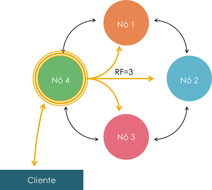
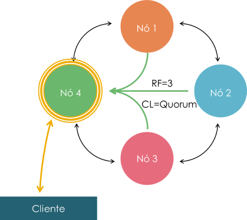
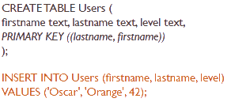
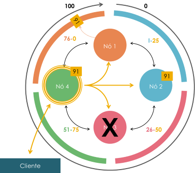

<!--
  bespokeEvent: bullets.disable
-->

# _Column-Family Stores_

---
# Roteiro

1. Como funcionam os Bancos de Famílias de Colunas (FC)
1. Exemplos de Bancos de Famílias de Colunas
1. Apache Cassandra
1. Quando usar + quando não usar

---
## Introdução aos Bancos <abbr title="Famílias de Colunas">FC</abbr>


| RDBMS                              | Cassandra (inicialmente)      | Cassandra (atualmente)        |
|------------------------------------|-------------------------------|-------------------------------|
| _database instance_                | _cluster_                     | _cluster_                     |
| _database_                         | _keyspace_                    | _keyspace_                    |
| _table_                            | _column family_               | _table_                       |
| _row_                              | _row_                         | _row_                         |
| _column_ (mesma para todas linhas) | _column_ (pode ser diferente) | _column_ (pode ser diferente) |
| SQL                                | Thrift                        | CQL                           |

---
a
---
## Em quem vamos focar?


---
<!--
  backdrop: cassandra-troy
-->

# 


---
## 

- Dados possuem formato flexível (parcialmente _schemaless_)
  - As famílias de colunas possue _schema_, mas as colunas não
- A interface com o banco é feita usando
  <abbr title="Cassandra Query Language">CQL</abbr>
  - Nas primeiras versões era uma linguagem chamada _Thrift_
- Origem: Facebook se inspirou no BigTable (armazenamento) e no DynamoDB
  (distribuição) e criou o Cassandra

---
## Objetivos

- Escalabilidade massivamente linear
  1. 
    Alta **escalabilidade**: aumento linear do desempenho com o número de nós
    do cluster
  1. Alta **disponibilidade**: considera falhas dos nós como regra e não exceção
    - Não há _single-point of failure_
  1. Alto **desempenho de escrita**: política de acesso ao disco eficiente e
    nível de consistência configurável

---
## Origem

<dl>
  <dt>2007</dt><dd>Cassandra **foi criado** para sustentar o _Inbox Search_ do
    **Facebook**</dd>
  <dt>**2008**</dt><dd>O Facebook o **tornou _open-source_** e o doou para a
    _Apache Software Foundation_</dd>
  <dt>2010</dt><dd>Cassandra tornou-se um projeto **"_top-level_" da Apache**
    e foi apadrinhado por uma empresa: [DataStax](http://www.datastax.com)</dd>
</dl>

|                          | Apache Cassandra (2008) | Google Big Table (2006) | Amazon DynamoDB (2007)  |
|--------------------------|-------------------------|-------------------------|-------------------------|
| Modelo de Dados          | _Column-Family_         | **_Column-Family_**     | _Key-Value_             |
| Teorema CAP              | AP                      | CP                      | **AP**                  |
| Modelo de Distribuição   | Descentralizado P2P     | _Master-Slave_          | **Descentralizado P2P** |
| Durabilidade             | Persistente             | **Persistente**         | _In-memory_             |
| Controle de Concorrência | MVCC                    | Locks                   | ACID                    |

---
## Quem está usando


---
## Por onde começar?


---
<!--
  backdrop: emphatic
-->

# Ferramentas
---
## Servidor do Cassandra

- O cassandra pode ser configurado **como serviço** (o instalador já faz isso)
  ou iniciado **manualmente**.
- Para abrir uma instância manualmente, usamos o utilitário
  **`cassandra(.exe)`**:
  ```
  cassandra <options>
  ```
  - `-f`: inicia no _foreground_ em vez de _background_
  - `-p <arquivo>`: salva o <abbr title="Process ID">PID</abbr> em arquivo
  - `-v`: mostra a versão do cassandra
  - `-D <parametro>`: passa um parâmetro de configuração para o cassandra

---
## Ferramentas Acessórias

- **`nodetool`**: Um utilitário de linha de comando para gerenciamento do
  _cluster_ cassandra
  ```
  nodetool –h host –p jmx_port [command] [options]
  ```
  
  - Principais comandos:
    - `status`: situação do _cluster_, carga, _host id_ e _token_
    - `info`: uso de memória, carga do disco, _uptime_ etc.
    - `ring`: situação do nó e do _ring_ do _cluster_

---
## Ferramentas Acessórias

- **`cqlsh`**: uma <abbr title="Command Line Interface">CLI</abbr> interativa
  que possibilita a execução de CQL em uma instância do Cassandra (por padrão
  é a local):
  ```
  cqlsh [options] [host [port]]
  ```
  - O `cqlsh` tem suporte a:
    1. Comandos CQL para definição e manipulação de dados
    1. Comandos _shell_ auxiliares (que não são CQL)

| Comando     | Descrição                                         |
|-------------|---------------------------------------------------|
| CONSISTENCY | Mostra ou define o nível de consistência desejado |
| COPY        | Importa e exporta arquivos CSV                    |
| DESCRIBE    | Dá info sobre o cluster ou sobre objetos de dados |
| EXIT        | Encerra o cqlsh                                   |

---
## O **DevCenter** (da DataStax, [_free_](http://www.datastax.com/what-we-offer/products-services/devcenter))


---
## Outras Ferramentas

- **`cassandra-stress`**: vem junto com o Cassandra, serve para teste de carga de
  escrita e leitura
- **`ccm`** (_Cassandra Cluster Manager_): simula um _cluster_ em uma única
  máquina usando máquinas virtuais (não é oficial, mas dizem ser muito bom):


---
<!--
  backdrop: emphatic
-->

# Arquitetura Interna

---
## Organização do _Cluster_

- É um conjunto de nós iguais (modelo _peer-to-peer_):
  - **Nó**: uma instância do Cassandra
  - **Rack**: um conjunto lógico de nós (tipicamente um _rack_)
  - **Data Center**: um conjunto lógico de _racks_ (tipicamente num mesmo
    ambiente geográfico)
  - **Cluster**: o conjunto completo de nós, que mapeiam para o mesmo
    _token ring_


---
## Organização do _Cluster_ (2)

- <figure class="picture-steps right">
    
    
    
  </figure>
  Nós entram no _cluster_ baseado na configuração de seu
  arquivo `conf/cassandra.yaml`
- Principais configurações:
  - **`cluster_name`**: nome do _cluster_
  - **`seeds`**: conjunto inicial de IPs de alguns nós
  - `listen_address`: IP deste servidor

---
## Coordenação de Requisição

- <figure class="picture-steps right">
    
    
    
  </figure>
  O **coordenador** é o nó escolhido pelo cliente para
  receber uma solicitação de leitura ou escrita no _cluster_
  - **<u>Qualquer</u>** nó pode coordenar **<u>qualquer</u>**
    requisição
  - Cada requisição pode ser coordenada
    por um nó diferente
- Não há _single point of failure_

---

## Coordenação de Requisição

- 
  O coordenador gerencia o _Replication Factor_ (`RF`)
  - Quantos nós devo replicar? Vai de 1 a todos
  - `RF` é uma propriedade do _keyspace_
  - Toda escrita em cada nó tem um _timestamp_ próprio

---
## Coordenação de Requisição

- 
  O coordenador também aplica o _Consistency Level_ (`CF`)
  - **Quantos nós devem <u>confirmar</u> a leitura ou escrita**
  - `CL` pode ser diferente para cada requisição
  - Valores possíveis:
    - `ANY`
    - `ONE`
    - `QUORUM: (RF/2)+1`
    - `ALL`

---
## _Hashing_ Consistente

- 
  Dados são divididos em **partições**, identificadas cada uma
  por um _token_ único
  - **Partição**: análogo a uma linha da tabela
  - **_Token_**: valor inteiro gerado pelo algoritmo de _hashing_
    - **Identifica <u>em que nó do _cluster_ deve estar a partição</u>**
- Intervalo com 2<sup>64</sup> _tokens_

---
## O Particionador

- 
  **O particionador** é um sistema em cada nó que aplica uma
  função _hash_ específica nas "chaves primárias" de cada registro
  sendo inserido

  
- Há vários **tipos de particionadores disponíveis**

---
## O Particionador (2)

- 
  Imagine um intervalo de _token_ de 0 a 100 (em vez de
  -2<sup>63</sup> a +2<sup>63</sup>)
  - Cada nó do _cluster_ tem um _token_ desses, assim como
    cada partição
  - O valor do _token_ de um nó é o maior valor do segmento
    que pertence a ele
- Este segmento é o **intervalo de _token_ <u>primário</u>**
  desse nó

---
## Como o particionador funciona

- <figure class="picture-steps right" style="margin:0;">
    
    
    
    
  </figure>
  O particionador de um nó encontra o _hash_ da
  **chave de partição** para uma solicitação de escrita
- A chave **primária da tabela** define o valor da
  chave de partição

  

---
## Que tipos de particionadores existem?

- O Cassandra oferece 3 particionadores:
  1. `Murmur3Partitioner` (padrão): usa _hash_ [Murmur3](https://en.wikipedia.org/wiki/MurmurHash)
  2. `RandomPartitioner`: _hash_ MD5
  3. `ByteOrderedPartitioner` (obsoleto): distribuição léxica
- **`Murmur3Partitioner`** é o padrão e a opção indicada
- O Particionador deve ser escolhido no arquivo `cassandra.yaml` e
  deve ser **o mesmo para todos os nós do _cluster_**

  

---
## Configuração de Replicação

- Fator de replicação é configurado quando um _keyspace_ é criado
  - **`SimpleStrategy`**: um fator para o _cluster inteiro_
    ```sql
    CREATE KEYSPACE simple-demo
    WITH REPLICATION =
    {'class':'SimpleStrategy',
    'replication_factor':2}    
    ```
  - **`NetworkTopologyStrategy`**: um fator para cada _data center_
    ```sql
    CREATE KEYSPACE simple-demo
    WITH REPLICATION =
    {'class':'NetworkTopologyStrategy',
    'dc-east':2, 'dc-west':3}    
    ```

---
## Como um coordenador coordena escritas?

- O _keyspace_ da tabela de destino determina:
  - **Fator de replicação**: quantas réplicas fazer de cada partição
  - **Estratégia de replicação**: em que nó as réplicas devem ficar
- Todas as partições são "réplicas" - não há "originais"
  - **Primeira réplica**: colocada no nó que é dono do intervalo do _token_
  - **Nó mais próximo**: réplicas colocadas no mesmo _rack_, se possível
  - **Réplicas seguintes** (`RF` > 1): colocadas no intervalo secundário
  de outros nós, de acordo com a estratégia de replicação

---
## Como os dados são replicados nos nós?

- <figure class="picture-steps right" style="margin:0 0 0 1em;">
    
    
    
  </figure>
  **`SimpleStrategy`** – cria réplicas nos nós subsequentes
  ao nó do intervalo primário
  ```sql
  CREATE KEYSPACE demo
  WITH REPLICATION =
  {
    'class': 'SimpleStrategy',
    'replication_factor': 3
  }
  ```

---
## Como dados são replicados entre _data centers_?

- **`NetworkTopologyStrategy`** – distribui nos _racks_
  e _data centers_


---
## O _hinted handoff_

- 
  _Hinted handoff_ é um mecanismo de recuperação de escritas
  quando nós estão _offline_
- O coordenador pode armazenar um _hinted handoff_ se um
  nó alvo de uma escrita:
  - Sabe-se que está _offline_
  - Falha em acusar recebimento
- A escrita é efetivada no devido nó quando ele volta _online_

---
## Nível de Consistência

- <figure class="picture-steps clean right" style="margin:0 0 0 1em;">
    
    
    
    
  </figure>
  A **chave de partição** determina que nós recebem requisições
  - **Nível de consistência** - define quantos nós devem
  <u>confirmar recebimento</u> e possibilidade de atender à solicitação
- O sentido varia pelo tipo da requisição:
  1. **Escrita**: quantos nós precisam responder que receberam
    e fazer a escrita?
  2. **Leitura**: quantos nós precisam enviar seus dados
    mais recentes?

---
## Níveis de Consistência disponíveis

| Nome                | Descrição                                                                          | Indicação                                                                           |
|---------------------|------------------------------------------------------------------------------------|-------------------------------------------------------------------------------------|
| `ANY`               | Escrever em qualquer nó, guardar _hinted handoff_ se todos estiverem _offline_     | Disponibilidade mais alta, Consistência mais baixa (escrita)                        |
| `ALL`               | Verificar todos os nós. Falha se qualquer um estiver _offline_                     | Consistência mais alta, Disponibilidade mais baixa                                  |
| `ONE` (`TWO,THREE`) | Verifica com o(s) mais próximo(s) do coordenador                                   | Disponibilidade mais alta, Consistência mais baixa (leitura)                        |
| `QUORUM`            | Verifica quórum dos nós disponíveis                                                | Balanceado                                                                          |
| `LOCAL_ONE`         | Verifica com o nó mais próximo do coordenador, que esteja no mesmo _data center_   | Disponibilidade mais alta, Consistência mais baixa, sem tráfego inter-_data center_ |
| `LOCAL_QUORUM`      | Verifica quórum dos nós disponíveis dentro do próprio _data center_ do coordenador | Balanceado                                                                          |
| `EACH_QUORUM`       | Verifica quórum em cada _data center_ do _cluster_                                 | Balanceado, consistência inter-_data center_                                        |
|                     |                                                                                    |                                                                                     |
|                     |                                                                                    |                                                                                     |
---
## Operações Anti-Entropia

---
<!--
  backdrop: emphatic
-->

# Modelando os Dados
---
## Modelo de Dados e CQL

---
## Distribuição e Replicação

---
## Famílias de Colunas

---
## CQL: CRUD

---
## Modelo de Distribuição

- Modelo _peer-to-peer_
- Replicação configurável (tipicamente 3)


---
## Forma de armazenamento

---
## CQL (Cassandra Query Language)

- Uma forma familiar para interagir com o banco:
  - `CREATE, ALTER, DROP`
  - `SELECT, INSERT, UPDATE, DELETE`
- Substituiu o _Thrift API_ que havia antes
- Provê definições do _schema_ em um contexto flexível (NoSQL)
  ```
  CREATE TABLE Cantor (
    name VARCHAR,
    type VARCHAR,
    country VARCHAR,
    style VARCHAR,
    born INT,
    died INT,
    PRIMARY KEY (name)
  )
  ```


---
## JSON e BSON

- JSON é um [formato aberto](http://json.org/) para representação de dados,
  **fácil para pessoas e máquinas lerem**
  - 
    Criado por Douglas Crockford, Engenheiro da YAHOO
- Pode ser usado pelo mesmo objetivo que o `XML`: **interoperabilidade de
  dados**
- Possui alguns tipos de dados:
  1. Números (_double_ de 64 bits)
  1. _Strings_ (texto)
  1. Valores _Boolean_ (`true`/`false`)
  1. _Arrays_
  1. Objetos (estilo tabelas _hash_)

---
## Exemplo de um Objeto em JSON

- Arquivo `celebridade_da_computacao.json`
  ```json
  {
    "_id" : 1,
    "nome" : { "primeiro" : "John", "ultimo" : "Backus" },
    "contribs" : [ "Fortran", "ALGOL", "Backus-Naur Form" ],
    "premio" : [
      {
        "nome" : "W.W. McDowell Award",
        "ano" : 1967,
        "entregue_por" : "IEEE Computer Society"
      }
    ]
  }
  ```

---
## Formato **JSON para Armazenar**

- Não é a melhor ideia, visto que:
  - O formato `JSON` não tem um tipo:
    1. Para data/_timestamp_
    1. Para diferenciar números inteiros/reais, 32/64bits
    1. Para representar um campo binário (_e.g._, imagem)
  - Ele é textual, então ocupa mais espaço em disco do que se fosse binário

---
## Formato **BSON**

- Os criadores do MongoDB propuseram, então, o
  **[_Binary `JSON`_](http://bsonspec.org/)**, que o **`JSON` atendesse a
  demanda de armazenamento**

  
  - Além dos tipos mencionados, há também o tipo `ObjectId`

---
## Documentos: **_ObjectId_**

- O `ObjectId` é um tipo de dados `BSON` usado como chave dos documentos
  - Ele tem 12 bytes e é construído por:
    - 4 bytes representando um **_timestamp_ do "agora"**
    - 3 bytes identificando a **máquina**
    - 2 bytes identificando o **_process id_**
    - 3 bytes de **um contador**, iniciando de um número aleatório
  - A ideia é que o `ObjectId` de cada documento seja único na coleção
  - **Todo documento recebe um campo _\_id_**, com um valor de `ObjectId` único
    gerado pelo banco
    - Contudo também podemos passar um valor único nosso para _\_id_

---
## Documentos: Estrutura com Referências


---
## Documentos: Estrutura Embutida


---
## Documentos: Operações de Escrita

Writes are atomic at the document level
A Denormalized data model facilitates atomic write operations.
Normalizing the data over multiple collection would require multiple write operation that are not atomic.

---
## Documentos: Crescimento do Banco

Each time a document is updated the modification are done changing affected attributes
Each document has a maximum size of 16MB
If the document size exceeds MongoDB relocates the document on disk.
In MongoDB 3.0 this problem is minimized using the Power of 2 Sized Allocation

---
## Documentos: **Índices**

Indexes allows efficient queries on MongoDB.
They are used to limit the number of documents to inspect
Otherwise, it has to scan every document in a collection.
By default MongoDB create indexes only on the _\_id_ field
Indexes are created using B-tree and stores data of fields ordered by values.
In addition MongoDB returns sorted results by using the index.

---
## Documentos: Índices (2)


---
## Documentos: Índices (3)


---
## Documentos: Índices (4)


---
## Documentos: **Tipos de Índices**

Geospatial Index: 2d and 2sphere indexes
Text Indexes: performs tokenization, stopwords removal and stemming.
Hashed Indexes: used to provide an hash based sharding

---
<!--
  backdrop: chapter
-->

# Quando usar + quando não usar
---
## Vantagens

- Escalabilidade praticamente linear
- Sem ponto único de falha (SPOF)
- Documentos são unidades independentes
- Parcialmente _schema free_:
  - Dados não estruturados podem ser facilmente armazenados

---
<div class="layout-split-2" style="height: auto;">
  <section style="border-right: 4px dotted silver;">
  <h2>Quando usar</h2>
    <ul style="text-align: left">
      <li>**Log de eventos**: diferentes tipos de eventos, várias aplicações</li>
      <li>**Gerenciadores de Conteúdo**: _schema free_ dá flexibilidade</li>
      <li>**_Web Analytics_**: atualizar contadores e outras métricas</li>
      <li>**_E-commerce_**: _schema_ flexível para diferentes categorias
        de produtos</li>
    </ul>
  </section>
  <section>
    <h2>Quando não usar</h2>
    <ul style="text-align: left">
      <li>**Transações com muitas operações**: atomicidade de operações entre
        documentos não é garantido. Novos bancos têm suporte: RabenDB</li>
      <li>**Consultas sobre estruturas agregadas que mudam muito**: se a
        estrutura dos agregados está sob constante alteração, eles devem
        ser normalizados</li>
    </ul>
  </section>
</div>

---
# Referências

- Livro _"NoSQL Distilled"_
  - Capítulo 10: _Column-Family Stores_
