<!--
  bespokeEvent: bullets.disable
-->

# _Column-Family Stores_

---
# Roteiro

1. Como funcionam os Bancos de Famílias de Colunas (FC)
1. Apache Cassandra
  - Introdução
  - Ferramentas
  - Arquitetura interna
  - Modelo de dados
1. Quando usar + quando não usar

---
## Introdução aos Bancos <abbr title="Famílias de Colunas">FC</abbr>


| RDBMS                              | Cassandra (inicialmente)      | Cassandra (atualmente)        |
|------------------------------------|-------------------------------|-------------------------------|
| _database instance_                | _cluster_                     | _cluster_                     |
| _database_                         | _keyspace_                    | _keyspace_                    |
| _table_                            | _column family_               | _table_                       |
| _row_                              | _row_                         | _partition                    |
| _column_ (mesma para todas linhas) | _column_ (pode ser diferente) | _column_ (pode ser diferente) |
| SQL                                | Thrift                        | CQL                           |

---
## Em quem vamos focar?


---
<!--
  backdrop: cassandra-troy
-->

# 


---
## 

- Dados possuem formato flexível (parcialmente _schemaless_)
  - As famílias de colunas possue _schema_, mas as colunas não
- A interface com o banco é feita usando
  <abbr title="Cassandra Query Language">CQL</abbr>
  - Nas primeiras versões era uma linguagem chamada _Thrift_
- Origem: Facebook se inspirou no BigTable (armazenamento) e no DynamoDB
  (distribuição) e criou o Cassandra

---
## Objetivos

- Escalabilidade massivamente linear
  1. 
    Alta **escalabilidade**: aumento linear do desempenho com o número de nós
    do cluster
  1. Alta **disponibilidade**: considera falhas dos nós como regra e não exceção
    - Não há _single-point of failure_
  1. Alto **desempenho de escrita**: política de acesso ao disco eficiente e
    nível de consistência configurável

---
## Origem

<dl>
  <dt>2007</dt><dd>Cassandra **foi criado** para sustentar o _Inbox Search_ do
    **Facebook**</dd>
  <dt>**2008**</dt><dd>O Facebook o **tornou _open-source_** e o doou para a
    _Apache Software Foundation_</dd>
  <dt>2010</dt><dd>Cassandra tornou-se um projeto **"_top-level_" da Apache**
    e foi apadrinhado por uma empresa: [DataStax](http://www.datastax.com)</dd>
</dl>

|                          | Apache Cassandra (2008) | Google Big Table (2006) | Amazon DynamoDB (2007)  |
|--------------------------|-------------------------|-------------------------|-------------------------|
| Modelo de Dados          | _Column-Family_         | **_Column-Family_**     | _Key-Value_             |
| Teorema CAP              | AP                      | CP                      | **AP**                  |
| Modelo de Distribuição   | Descentralizado P2P     | _Master-Slave_          | **Descentralizado P2P** |
| Durabilidade             | Persistente             | **Persistente**         | _In-memory_             |
| Controle de Concorrência | MVCC                    | Locks                   | ACID                    |

---
## Quem está usando


---
<!--
  backdrop: emphatic
-->

# Ferramentas
---
## Servidor do Cassandra

- O cassandra pode ser configurado **como serviço** (o instalador já faz isso)
  ou iniciado **manualmente**.
- Para abrir uma instância manualmente, usamos o utilitário
  **`cassandra(.exe)`**:
  ```
  cassandra <options>
  ```
  - `-f`: inicia no _foreground_ em vez de _background_
  - `-p <arquivo>`: salva o <abbr title="Process ID">PID</abbr> em arquivo
  - `-v`: mostra a versão do cassandra
  - `-D <parametro>`: passa um parâmetro de configuração para o cassandra

---
## Ferramentas Acessórias

- **`nodetool`**: Um utilitário de linha de comando para gerenciamento do
  _cluster_ cassandra
  ```
  nodetool –h host –p jmx_port [command] [options]
  ```
  
  - Principais comandos:
    - `status`: situação do _cluster_, carga, _host id_ e _token_
    - `info`: uso de memória, carga do disco, _uptime_ etc.
    - `ring`: situação do nó e do _ring_ do _cluster_

---
## Ferramentas Acessórias

- **`cqlsh`**: uma <abbr title="Command Line Interface">CLI</abbr> interativa
  que possibilita a execução de CQL em uma instância do Cassandra (por padrão
  é a local):
  ```
  cqlsh [options] [host [port]]
  ```
  - O `cqlsh` tem suporte a:
    1. Comandos CQL para definição e manipulação de dados
    1. Comandos _shell_ auxiliares (que não são CQL)

| Comando     | Descrição                                         |
|-------------|---------------------------------------------------|
| CONSISTENCY | Mostra ou define o nível de consistência desejado |
| COPY        | Importa e exporta arquivos CSV                    |
| DESCRIBE    | Dá info sobre o cluster ou sobre objetos de dados |
| EXIT        | Encerra o cqlsh                                   |

---
## O **DevCenter** (da DataStax, [_free_](http://www.datastax.com/what-we-offer/products-services/devcenter))

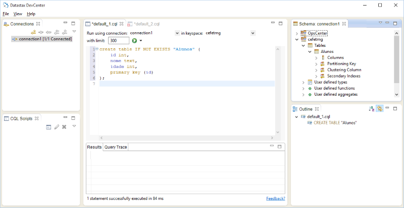

---
## Outras Ferramentas

- **`cassandra-stress`**: vem junto com o Cassandra, serve para teste de carga de
  escrita e leitura
- **`ccm`** (_Cassandra Cluster Manager_): simula um _cluster_ em uma única
  máquina usando máquinas virtuais (não é oficial, mas dizem ser muito bom):


---
<!--
  backdrop: emphatic
-->

# Arquitetura Interna

---
## Organização do _Cluster_

- É um conjunto de nós iguais (modelo _peer-to-peer_):
  - **Nó**: uma instância do Cassandra
  - **Rack**: um conjunto lógico de nós (tipicamente um _rack_)
  - **Data Center**: um conjunto lógico de _racks_ (tipicamente num mesmo
    ambiente geográfico)
  - **Cluster**: o conjunto completo de nós, que mapeiam para o mesmo
    _token ring_


---
## Organização do _Cluster_ (2)

- <figure class="picture-steps right">
    
    
    
  </figure>
  Nós entram no _cluster_ baseado na configuração de seu
  arquivo `conf/cassandra.yaml`
- Principais configurações:
  - **`cluster_name`**: nome do _cluster_
  - **`seeds`**: conjunto inicial de IPs de alguns nós
  - `listen_address`: IP deste servidor

---
## Coordenação de Requisição

- <figure class="picture-steps right">
    
    
    
  </figure>
  O **coordenador** é o nó escolhido pelo cliente para
  receber uma solicitação de leitura ou escrita no _cluster_
  - **<u>Qualquer</u>** nó pode coordenar **<u>qualquer</u>**
    requisição
  - Cada requisição pode ser coordenada
    por um nó diferente
- Não há _single point of failure_

---

## Coordenação de Requisição

- 
  O coordenador gerencia o _Replication Factor_ (`RF`)
  - Quantos nós devo replicar? Vai de 1 a todos
  - `RF` é uma propriedade do _keyspace_
  - Toda escrita em cada nó tem um _timestamp_ próprio

---
## Coordenação de Requisição

- 
  O coordenador também aplica o _Consistency Level_ (`CF`)
  - **Quantos nós devem <u>confirmar</u> a leitura ou escrita**
  - `CL` pode ser diferente para cada requisição
  - Valores possíveis:
    - `ANY`
    - `ONE`
    - `QUORUM: (RF/2)+1`
    - `ALL`

---
## _Hashing_ Consistente

- 
  Dados são divididos em **partições**, identificadas cada uma
  por um _token_ único
  - **Partição**: análogo a uma linha da tabela
  - **_Token_**: valor inteiro gerado pelo algoritmo de _hashing_
    - **Identifica <u>em que nó do _cluster_ deve estar a partição</u>**
- Intervalo com 2<sup>64</sup> _tokens_

---
## O Particionador

- 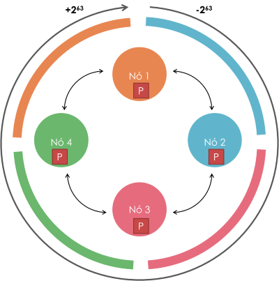
  **O particionador** é um sistema em cada nó que aplica uma
  função _hash_ específica nas "chaves primárias" de cada registro
  sendo inserido

  
- Há vários **tipos de particionadores disponíveis**

---
## O Particionador (2)

- 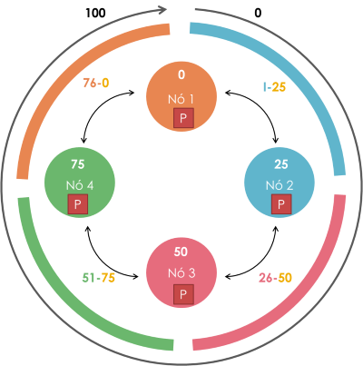
  Imagine um intervalo de _token_ de 0 a 100 (em vez de
  -2<sup>63</sup> a +2<sup>63</sup>)
  - Cada nó do _cluster_ tem um _token_ desses, assim como
    cada partição
  - O valor do _token_ de um nó é o maior valor do segmento
    que pertence a ele
- Este segmento é o **intervalo de _token_ <u>primário</u>**
  desse nó

---
## Como o particionador funciona

- <figure class="picture-steps right" style="margin:0;">
    
    
    
    
  </figure>
  O particionador de um nó encontra o _hash_ da
  **chave de partição** para uma solicitação de escrita
- A chave **primária da tabela** define o valor da
  chave de partição

  

---
## Que tipos de particionadores existem?

- O Cassandra oferece 3 particionadores:
  1. `Murmur3Partitioner` (padrão): usa _hash_ [Murmur3](https://en.wikipedia.org/wiki/MurmurHash)
  2. `RandomPartitioner`: _hash_ MD5
  3. `ByteOrderedPartitioner` (obsoleto): distribuição léxica
- **`Murmur3Partitioner`** é o padrão e a opção indicada
- O Particionador deve ser escolhido no arquivo `cassandra.yaml` e
  deve ser **o mesmo para todos os nós do _cluster_**

  

---
## Configuração de Replicação

- Fator de replicação é configurado quando um _keyspace_ é criado
  - **`SimpleStrategy`**: um fator para o _cluster inteiro_
    ```sql
    CREATE KEYSPACE simple-demo
    WITH REPLICATION =
    {'class':'SimpleStrategy',
    'replication_factor':2}    
    ```
  - **`NetworkTopologyStrategy`**: um fator para cada _data center_
    ```sql
    CREATE KEYSPACE simple-demo
    WITH REPLICATION =
    {'class':'NetworkTopologyStrategy',
    'dc-east':2, 'dc-west':3}    
    ```

---
## Como um coordenador coordena escritas?

- O _keyspace_ da tabela de destino determina:
  - **Fator de replicação**: quantas réplicas fazer de cada partição
  - **Estratégia de replicação**: em que nó as réplicas devem ficar
- Todas as partições são "réplicas" - não há "originais"
  - **Primeira réplica**: colocada no nó que é dono do intervalo do _token_
  - **Nó mais próximo**: réplicas colocadas no mesmo _rack_, se possível
  - **Réplicas seguintes** (`RF` > 1): colocadas no intervalo secundário
  de outros nós, de acordo com a estratégia de replicação

---
## Como os dados são replicados nos nós?

- <figure class="picture-steps right" style="margin:0 0 0 1em;">
    
    
    
  </figure>
  **`SimpleStrategy`** – cria réplicas nos nós subsequentes
  ao nó do intervalo primário
  ```sql
  CREATE KEYSPACE demo
  WITH REPLICATION =
  {
    'class': 'SimpleStrategy',
    'replication_factor': 3
  }
  ```

---
## Como dados são replicados entre _data centers_?

- **`NetworkTopologyStrategy`** – distribui nos _racks_
  e _data centers_
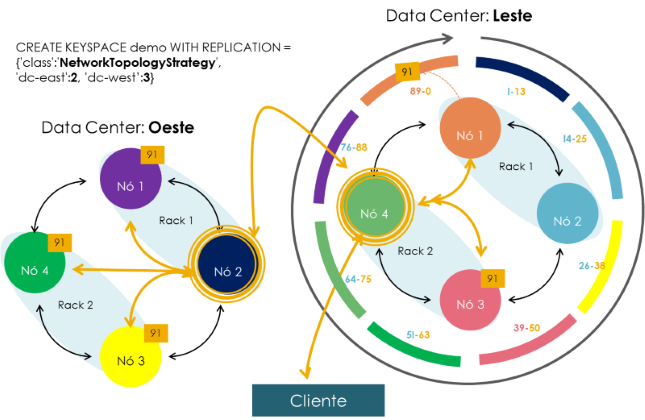

---
## O _hinted handoff_

- 
  _Hinted handoff_ é um mecanismo de recuperação de escritas
  quando nós estão _offline_
- O coordenador pode armazenar um _hinted handoff_ se um
  nó alvo de uma escrita:
  - Sabe-se que está _offline_
  - Falha em acusar recebimento
- A escrita é efetivada no devido nó quando ele volta _online_

---
## Nível de Consistência

- <figure class="picture-steps clean right" style="margin:0 0 0 1em;">
    
    
    
    
  </figure>
  A **chave de partição** determina que nós recebem requisições
  - **Nível de consistência** - define quantos nós devem
  <u>confirmar recebimento</u> e possibilidade de atender à solicitação
- O sentido varia pelo tipo da requisição:
  1. **Escrita**: quantos nós precisam responder que receberam
    e fazer a escrita?
  2. **Leitura**: quantos nós precisam enviar seus dados
    mais recentes?

---
## Níveis de Consistência disponíveis

| Nome                | Descrição                                                                          | Indicação                                                                           |
|---------------------|------------------------------------------------------------------------------------|-------------------------------------------------------------------------------------|
| `ANY`               | Escrever em qualquer nó, guardar _hinted handoff_ se todos estiverem _offline_     | Disponibilidade mais alta, Consistência mais baixa (escrita)                        |
| `ALL`               | Verificar todos os nós. Falha se qualquer um estiver _offline_                     | Consistência mais alta, Disponibilidade mais baixa                                  |
| `ONE` (`TWO,THREE`) | Verifica com o(s) mais próximo(s) do coordenador                                   | Disponibilidade mais alta, Consistência mais baixa (leitura)                        |
| `QUORUM`            | Verifica quórum dos nós disponíveis                                                | Balanceado                                                                          |
| `LOCAL_ONE`         | Verifica com o nó mais próximo do coordenador, que esteja no mesmo _data center_   | Disponibilidade mais alta, Consistência mais baixa, sem tráfego inter-_data center_ |
| `LOCAL_QUORUM`      | Verifica quórum dos nós disponíveis dentro do próprio _data center_ do coordenador | Balanceado                                                                          |
| `EACH_QUORUM`       | Verifica quórum em cada _data center_ do _cluster_                                 | Balanceado, consistência inter-_data center_                                        |
|                     |                                                                                    |                                                                                     |
|                     |                                                                                    |                                                                                     |

---
## Consistência **imediata** _vs_ **eventual**

- Para uma requisição de leitura, qual a chance de receber
  dados ultrapassados?
- **Consistência imediata**: leitura sempre retorna os dados mais
  recentes
  - `CL = ALL` garante consistência imediata porque todas as
    réplicas são verificadas e comparadas antes do resultado
    ser enviado ao cliente
  - **Latência mais alta**
- **Consistência eventual**: leitura pode retornar dado
  ultrapassado
  - `CL = ONE` tem o maior risco de _stale data_
  - **Menor latência**

---
## Como podemos **ajustar a consistência**

- 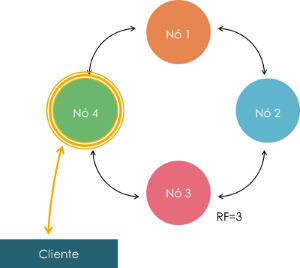
  Podemos ajustar o `CL` a cada leitura ou escrita
  ```text
  if (nos_escritos + nos_lidos) > RF
  then "temos consistência imediata"
  ```
  - Casos:
    - `CL` escrita `ALL` / leitura `ONE`
    - `CL` escrita `QUORUM` / leitura `QUORUM`
    - `CL` escrita `ONE` / leitura `ALL`

---
## Como **escolher** o nível de consistência

- Dado um cenário, o benefício da consistência imediata
  justifica o custo de latência?
  - A Netflix usa `CL=ONE` e mede sua janela de inconsistência em milisegundos

| Nível de Consistência `ONE`        | Nível de Consistência `QUORUM` | Nível de Consistência `ALL` |
|------------------------------------|--------------------------------|-----------------------------|
| **Menor latência**                 | Latência mais alta             | Latência mais alta de todas |
| **Maior vazão**                    | Menor vazão                    | Menor vazão de todas        |
| **Maior disponibilidade de todas** | Maior disponibilidade          | Menor disponibilidade       |
| Possibilidade de _stale read_      | **Sem _stale read_**           | **Sem _stale read_**        |

---
## Operações **Anti-Entropia**

- Como parte do processo de leitura, o coordenador envia:
  1. A consulta original do cliente para a réplica mais saudável
  1. Uma consulta para apenas a assinatura (_checksum_) do dado
    para as outras réplicas  
- Ao receber de todos, o coordenador compara as assinaturas
  recebidas com a assinatura que ele mesmo tirou dos dados
  recebidos da réplica mais saúdavel
  - Caso as assinaturas sejam iguais, retorna o dado para o cliente
  -Se elas divergirem, há inconsistência entre as réplicas
  - Resolver essa inconsistência é fazer um **_read repair_**

---
## _Read-Repair_

<figure class="picture-steps clean right">
  
  
  
</figure>

---
<!--
  backdrop: emphatic
-->

# Modelo de Dados
---
## Principais Conceitos

- O modelo de dados do Cassandra define:
  1. **Família de coluna**, como uma forma de armazenar e organizar dados
  1. **Tabela**, que é uma visão bidimensional de uma
    <abbr title="Column Family">CF</abbr> multi-dimensional
  1. **Operações em tabelas** usando Cassandra Query Language (CQL)

---
## _row, row key, column key, column value_

- **_Row_** é a menor unidade que armazena dados relacionados

<dl>
  <dt>**_Rows_**</dt><dd>_rows_ individuais constituem uma família
    de colunas</dd>
  <dt>**_Row key_**</dt><dd>identifica a _row_ dentro da CF de
    forma única</dd>
  <dt>**_Row_**</dt><dd>armazena pares de _column keys_ e _values_
    </dd>
  <dt>**_Column key_**</dt><dd>identifica um _column value_
    de uma _row_
    </dd>
  <dt>**_Col. value_**</dt><dd>armazena um valor ou uma coleção
    </dd>
</dl>

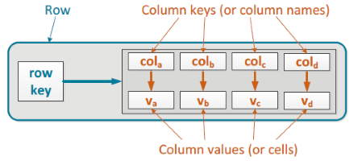

---
## Exemplo de _rows_

- _Rows_ de artista e banda:
  - As chaves das colunas (_column keys_) são sempre ordenadas


- Uma _row_ pode ser recuperada se conhecermos sua _row key_
- Um _column value_ pode ser recuperado se conhecermos sua
  _row key_ e _column key_

---
# Exemplos de _rows_ (2)

- **_Row key_ composta**: múltiplos componentes, separados por ":"
  
  - 'Revolver' e 1966 são o título e ano do álbum
  - O valor da coluna 'tracks' é uma coleção (um _map_)
- **_Column key_ composta**: múltiplos componentes, separados por ":"
  
  - 1,2,...,14 são os números das faixas

---
# Exemplos de _rows_ (2)

- _Row_ pode conter _colum keys_ simples e compostas ao mesmo tempo
  
  - 'genre' e 'performer' são _column keys_ simples
  - '1:title', '2:title'... são _column keys_ compostas

---
## Onde podemos **guardar dados**?
- Qualquer componente de uma _row_ pode armazenar dados
  ou metadados
  - _Row key_ simples ou composta
  - _Column key_ simples ou composta
  - Dados atômicos ou em coleções em _column values_

  - **Metadados**: 'Side One', 'Side Two', 'title', 'duration'
  - **Dados**: todo o resto ('Revolver', '1966'...)

---
## **Família de Colunas**

- **Família de coluna**: é um conjunto de _rows_ com
  estrutura parecida

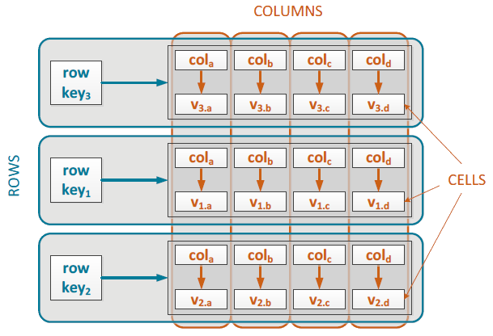

---
## Família de Colunas (2)

- É uma estrutura que pode ser distribuída (_sharding_)
- Pode ser esparsa
  - Família de coluna que armazena dados sobre artistas e bandas

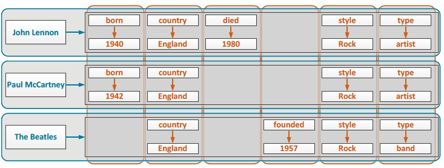

---
## Família de Colunas (3)

- As colunas estão sempre ordenadas pela chave
- Estrutura multi-dimensional
  - Família de colunas que armazena albums e suas faixas

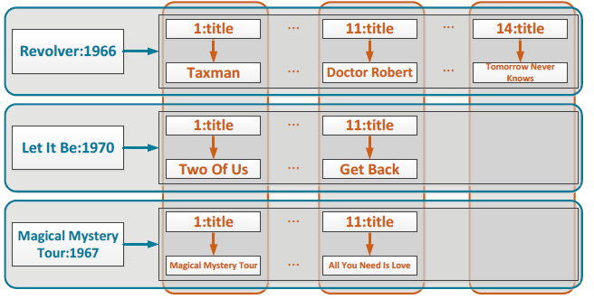

---
## Tabela _vs_ Família de Coluna

- Uma tabela CQL é uma família de coluna
  - A tabela fornece visões 2D de uma família de colunas, que
    **potencialmente contém dados multi-dimensionais** devido
    às chaves compostas e coleções

| Tabela (em termos de CQL)                                                                                    | Família de Coluna (Thrift)                                                                |
|--------------------------------------------------------------------------------------------------------------|-------------------------------------------------------------------------------------------|
| Tabela é um **conjunto de partições**                                                                        | FC é um conjunto de _rows_                                                                |
| Partição pode ser composta por uma ou mais _rows_                                                            | _Row key_ identifica unicamente a _row_ e pode ser simples ou composta                    |
| Coluna identifica uma célula em uma partição                                                                 | _Column key_ identifica unicamente uma célula em uma _row_ e pode ser simples ou composta |
| Chave primária é composta pela chave da partição  mais _clustering columns_ e identificam unicamente a _row_ |                                                                                        ...|

---
## Partição, chave de partição

- **Tabela** cujas **partições são apenas 1 _row_ cada**:

- Visualização da **família de coluna**:
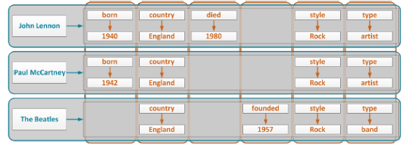

---
## Partição, chave de partição (2)

- Tabela com **partições com múltiplas _rows_**:


---
## Colunas **estáticas**

- Tabela com partições com múltiplas _rows_:

- Os valores das colunas estáticas são os mesmos para todas
  as _rows_ em uma partição com múltiplas _rows_

---
## Colunas **estáticas** (2)

- Tabela com partições com múltiplas _rows_:
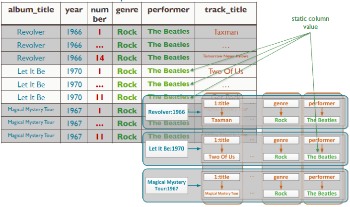

---
## **Chave primária** de uma tabela

- A chave primária identifica unicamente uma _row_ da tabela
  - Formada pela chave de partição (simples ou composta) e pelas
    colunas de _clusterização_ (se houver)
    
  - 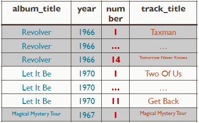
    **Chave primária** da tabela acima: **`performer`**
  - **Chave primária** da tabela à direita: **`album, year, number`**
  - Colunas estáticas não podem fazer parte da chave primária

---
## CQL (Cassandra Query Language)

- Uma forma familiar para interagir com o banco:
  - `CREATE, ALTER, DROP`
  - `SELECT, INSERT, UPDATE, DELETE`
- Substituiu o _Thrift API_ que havia antes
- Provê definições do _schema_ em um contexto flexível (NoSQL)
  ```
  CREATE TABLE Singer (
    name VARCHAR,
    type VARCHAR,
    died INT,
    PRIMARY KEY (name)
  )
  ```

---
## CQL: Criando _keyspaces_

- Para criar um _keyspace_ (um banco):
  ```sql
  CREATE KEYSPACE musicdb
  WITH replication = {
    'class': 'SimpleStrategy',
    'replication_factor' : 3
  };
  ```
- Para começar a usá-lo:
  ```sql
  USE musicdb;
  ```
- Para excluir:
  ```sql
  DROP KEYSPACE musicdb;
  ```

---
## CQL: Criando uma tabela

- A chave primária pode ser definida "_in loco_" ou por último

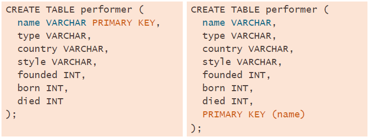

---
## Chave primária, de partição e _clustering_

- Chave de partição simples
  ```sql
  PRIMARY KEY ( partition_key_column )
  ```
- Chave de partição composta
  ```sql
  PRIMARY KEY ( (partition_key_column1, ...2 ) )
  ```
- Chave de
---
<!--
  backdrop: chapter
-->

# Quando usar + quando não usar
---
## Vantagens

- Escalabilidade praticamente linear
- Sem ponto único de falha (SPOF)
- Documentos são unidades independentes
- Parcialmente _schema free_:
  - Dados não estruturados podem ser facilmente armazenados

---
<div class="layout-split-2" style="height: auto;">
  <section style="border-right: 4px dotted silver;">
  <h2>Quando usar</h2>
    <ul style="text-align: left">
      <li>Grande demanda por escrita</li>
      <li>Precisa de durabilidade</li>
      <li>Não há SPoF</li>
      <li>Grande quantidade de dados</li>
    </ul>
  </section>
  <section>
    <h2>Quando não usar</h2>
    <ul style="text-align: left">
      <li>Transações ACID são indispensáveis</li>
    </ul>
  </section>
</div>

---
# Referências

- Livro _"NoSQL Distilled"_
  - Capítulo 10: _Column-Family Stores_
