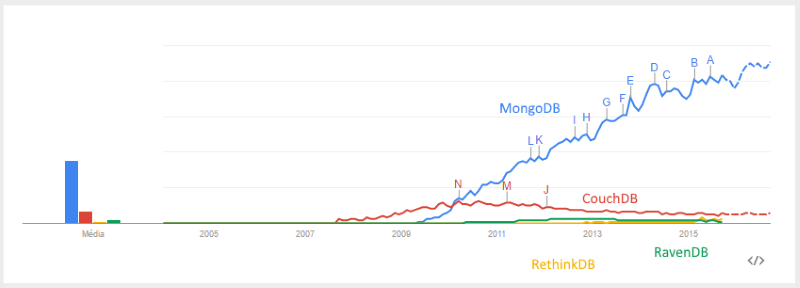
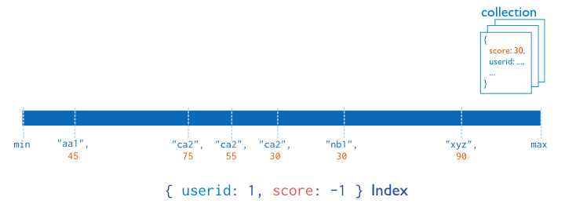

<!--
  bespokeEvent: bullets.disable
-->

# _Document Stores_

---
# Roteiro

1. Como funcionam os bancos de documentos
1. Exemplos de bancos de documentos
1. O MongoDB
1. Quando usar + quando não usar

---
## Introdução aos Bancos de Documentos

- **Documentos** são o principal conceito
- Um banco de dados orientado a documentos armazena e recupera documentos
  - Eles podem ser **salvos em formatos "interoperáveis"**:
    - <abbr title="eXtensible Markup Language">XML</abbr>, <abbr title="JavaScript Object Notation">JSON</abbr>, <abbr title="Binary JSON">BSON</abbr> etc.
- Documentos são:
  - Auto-descritivos
  - Estruturas de dados hierárquicas (mapas, coleções e escalares)
    ```json
    {
      "name": "Sue",
      "age": 26,
      "groups": ["news", "sports"]
    }
    ```
---
## O que é um Banco de Documentos

- Eles armazenam documentos como o a parte **valor** dos bancos _key-value_,
  sendo que os documentos:
  - São indexados usando uma _BTree_
  - São consultados usando API para linguagens (não há SQL)
- Considere um banco de documentos como um _key-value_ onde o _value_ é
  examinável pelo banco (`WHERE`)

| Oracle                      | MongoDB              |
|-----------------------------|----------------------|
| instância de banco de dados | instância do MongoDB |
| schema                      | database             |
| table                       | collection           |
| row                         | document             |
| rowid                       | _id                  |

---
## Exemplo: **Coleção** de viajantes

```json
{
  "firstname": "Martin",
  "likes": ["Biking", "Photography"],
  "lastcity": "Boston"
}
```
```json
{
  "firstname": "Pramod",
  "lastcity": "Chicago"
}
```

- Documentos de uma coleção podem ter atributos diferentes
- Isto difere de uma tabela relacional onde colunas:
  - Armazenam o mesmo tipo de valor ou `null`

---
<!--
  backdrop: chapter
-->

# Exemplos de bancos de documentos
---
# Alguns Bancos de Documentos

- [**MongoDB**](https://www.mongodb.org/)
  - JSON, API com drivers, _auto-sharding_
- [CouchDB](http://couchdb.apache.org/)
  - JSON, JavaScript para MapReduce e acesso via HTTP
- [RethinkDB](https://www.rethinkdb.com/)
  - JSON, _real-time_, API com drivers
- [RavenDB](http://ravendb.net/)
  - JSON, Transações ACID, acesso via HTTP ou .NET

---
## <abbr title="Cluster of unreliable commodity hardware">Couch</abbr>DB

- 
  Escrito em Erlang, 2005-2008, doado à fundação Apache
- Documentos armazenados em `JSON`
- A linguagem de consulta é em JavaScript/RESTful WebService e
  suporta MapReduce
- Conceito de <abbr title="Multi-Version Concurrency Control">MVCC</abbr> como
  uma estratégia de **resolução otimista para conflitos**

---
## CouchDB: Características

- Característica de destaque: **replicação _multi-master_**
  - Todo nó pode **escrever**
  - Diferente de _peer-to-peer_ porque é síncrono
  - É possível por causa do estilo _append-only_ dos _commits_
- Versões para dispositivos móveis
- Interação com os dados via HTTP (RESTful WebService) apenas
  - Não há um protocolo binário

---
## 

- Escrito em C++, executa em Linux e OSX
- Armazena documentos no formato JSON
- Principal característica: **notificação de atualizações para aplicação
  _real-time_**
- Suporta MapReduce e consultas geoespaciais

```js
r.table('tv_shows')
  .insert([
    { name: 'Star Trek TNG', episodes: 178 },
    { name: 'Battlestar Galactica', episodes: 75 }
  ]);
```

---
## Em quem vamos focar?



---
<!--
  backdrop: mongodb-forest
-->

# 

---
## 

<p class="note" style="width: 90%;">
  _“MongoDB” derives from the word **“humongous”** because of its ability to
  scale up with ease and hold very large amounts of data._
</p>

- Dados possuem formato flexível
- Nossa interface com o banco é feita por documentos no formato
  <abbr title="JavaScript Object Notation">`JSON`</abbr>, mas
  são armazenados em <abbr title="Binary JSON">`BSON`</abbr>
  - `BSON` ocupa bem menos espaço
  - `BSON` possui bem mais tipos de dados do que `JSON`
- Relações podem ser representadas como referências ou como documentos
  aninhados (embutidos)
- _Whitepaper_ da [Arquitetura do MongoDB](http://s3.amazonaws.com/info-mongodb-com/MongoDB_Architecture_Guide.pdf)

---
## JSON e BSON

- JSON é um [formato aberto](http://json.org/) para representação de dados,
  **fácil para pessoas e máquinas lerem**
  - 
    Criado por Douglas Crockford, Engenheiro da YAHOO
- Pode ser usado pelo mesmo objetivo que o `XML`: **interoperabilidade de
  dados**
- Possui alguns tipos de dados:
  1. Números (_double_ de 64 bits)
  1. _Strings_ (texto)
  1. Valores _Boolean_ (`true`/`false`)
  1. _Arrays_
  1. Objetos (estilo tabelas _hash_)

---
## Exemplo de um Objeto em JSON

- Arquivo `celebridade_da_computacao.json`
  ```json
  {
    "_id" : 1,
    "nome" : { "primeiro" : "John", "ultimo" : "Backus" },
    "contribs" : [ "Fortran", "ALGOL", "Backus-Naur Form" ],
    "premio" : [
      {
        "nome" : "W.W. McDowell Award",
        "ano" : 1967,
        "entregue_por" : "IEEE Computer Society"
      }
    ]
  }
  ```

---
## Formato **JSON para Armazenar**

- Não é a melhor ideia, visto que:
  - O formato `JSON` não tem um tipo:
    1. Para data/_timestamp_
    1. Para diferenciar números inteiros/reais, 32/64bits
    1. Para representar um campo binário (_e.g._, imagem)
  - Ele é textual, então ocupa mais espaço em disco do que se fosse binário

---
## Formato **BSON**

- Os criadores do MongoDB propuseram, então, o
  **[_Binary `JSON`_](http://bsonspec.org/)**, que o **`JSON` atendesse a
  demanda de armazenamento**

  
  - Além dos tipos mencionados, há também o tipo `ObjectId`

---
## Documentos: **_ObjectId_**

- O `ObjectId` é um tipo de dados `BSON` usado como chave dos documentos
  - Ele tem 12 bytes e é construído por:
    - 4 bytes representando um **_timestamp_ do "agora"**
    - 3 bytes identificando a **máquina**
    - 2 bytes identificando o **_process id_**
    - 3 bytes de **um contador**, iniciando de um número aleatório
  - A ideia é que o `ObjectId` de cada documento seja único na coleção
  - **Todo documento recebe um campo _\_id_**, com um valor de `ObjectId` único
    gerado pelo banco
    - Contudo também podemos passar um valor único nosso para _\_id_

---
## Documentos: Estrutura com Referências


---
## Documentos: Estrutura Embutida


---
## Documentos: Operações de Escrita

Writes are atomic at the document level
A Denormalized data model facilitates atomic write operations.
Normalizing the data over multiple collection would require multiple write operation that are not atomic.

---
## Documentos: Crescimento do Banco

Each time a document is updated the modification are done changing affected attributes
Each document has a maximum size of 16MB
If the document size exceeds MongoDB relocates the document on disk.
In MongoDB 3.0 this problem is minimized using the Power of 2 Sized Allocation

---
## Documentos: **Índices**

Indexes allows efficient queries on MongoDB.
They are used to limit the number of documents to inspect
Otherwise, it has to scan every document in a collection.
By default MongoDB create indexes only on the _\_id_ field
Indexes are created using B-tree and stores data of fields ordered by values.
In addition MongoDB returns sorted results by using the index.

---
## Documentos: Índices (2)


---
## Documentos: Índices (3)


---
## Documentos: Índices (4)



---
## Documentos: **Tipos de Índices**

Geospatial Index: 2d and 2sphere indexes
Text Indexes: performs tokenization, stopwords removal and stemming.
Hashed Indexes: used to provide an hash based sharding

---
<!--
  backdrop: chapter
-->

# Quando usar + quando não usar
---
## Vantagens

- Documentos são unidades independentes
- Lógica de aplicação é fácil de escrever
- _Schema free_:
  - Dados não estruturados podem ser facilmente armazenados
  - Migrações de dados podem ser evitadas já que o banco não precisa
    ter conhecimento de um _schema_

---
<div class="layout-split-2" style="height: auto;">
  <section style="border-right: 4px dotted silver;">
  <h2>Quando usar</h2>
    <ul style="text-align: left">
      <li>**Log de eventos**: diferentes tipos de eventos, várias aplicações</li>
      <li>**Gerenciadores de Conteúdo**: _schema free_ dá flexibilidade</li>
      <li>**_Web Analytics_**: atualizar contadores e outras métricas</li>
      <li>**_E-commerce_**: _schema_ flexível para diferentes categorias
        de produtos</li>
    </ul>
  </section>
  <section>
    <h2>Quando não usar</h2>
    <ul style="text-align: left">
      <li>**Transações com muitas operações**: atomicidade de operações entre
        documentos não é garantido. Novos bancos têm suporte: RabenDB</li>
      <li>**Consultas sobre estruturas agregadas que mudam muito**: se a
        estrutura dos agregados está sob constante alteração, eles devem
        ser normalizados</li>
    </ul>
  </section>
</div>
