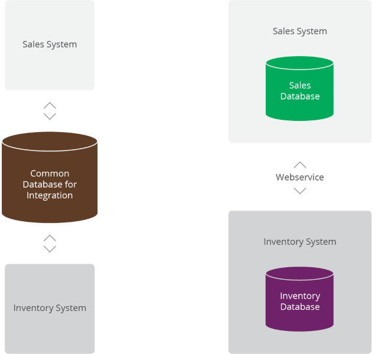
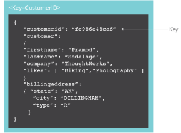
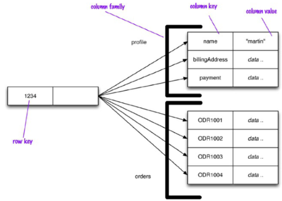

<!--
 backdrop: batman-symbol
-->

# Introdução a NoSQL

---
# Roteiro

1. Por quê NoSQL (capítulo 1)
1. Modelos de Dados Agregados (capítulo 2)
1. Um pouco mais sobre Modelos de Dados (capítulo 3)

---
<!--
  backdrop: batman-lego
-->

# Por quê NoSQL?

---
<!--
  backdrop: chapter
-->

# Introdução a NoSQL
---
<!--
  backdrop: emphatic
-->

# Como chegamos até aqui?

---
## O valor dos bancos **relacionais**

- Dados persistidos
  - Arquitetura de duas memórias: principal e secundária
  - Sistemas de arquivos _vs._ bancos de dados
- Concorrência
  - Possibilitar (ou impedir) acessos/gravações simultâneas por mais de um
    usuário
  - Implementado por transações

---
## O valor dos bancos **relacionais** (cont.)

- Integração
  - Mais de uma aplicação acessando/gravando no mesmo banco de dados
  - Implementado por transações também
- Modelo (praticamente) padronizado
  - Apesar de vários "fabricantes", todos usam (praticamente) os mesmos mecanismos
    - _e.g._, dialetos SQL similares, transações funcionam de forma bem parecida

---
# Descompasso de Impedância

<p style="margin:0;">
  
</p>

- Apesar de grandes vantagens, os RDBMSs não são perfeitos
- Desenvolvedores frustram-se pelo **descompasso de impedância**, que é a
  **"diferença entre o modelo relacional e as estruturas de dados na memória"**

---
## Descompaso de Impedância (cont.)

- A frustração dos desenvolvedores era grande
  - Na década de 90, chegou-se a pensar que os RDBMSs seriam substituídos por bancos de dados que replicassem a estrutura _in-memory_ no disco
  - Linguagens orientadas a objeto em crescimento
  - Ideia: bancos de dados orientados a objetos (<abbr title="Object Oriented Database Management System">OODBMS</abbr>)
    - _e.g._, ObjectStore: _"Objects can be created in a database by overloading the operator `new()`"_
      - [Artigo na _Communications of the ACM_](http://dl.acm.org/citation.cfm?doid=125223.125244) descrevendo o funcionamento  

---
## Amenizando o Descompasso

- Linguagens <abbr title="Orientadas a Objetos">OO</abbr> tiveram sucesso, mas
  os bancos não. Motivos:
  - SQL já existia, mas o <abbr title="Object Query Language">OQL</abbr>
    demorou a sair (2001)
  - Divisão do trabalho entre desenvolvedor e DBAs
- Nova ideia para reduzir o descompasso de impedância: **mapeamento
  objeto-relacional**
  - Hibernate, ~~iBATIS~~[MyBATIS](http://blog.mybatis.org/)
- Apesar de ajudar muito, ainda há o problema do mapeamento
  - _e.g._, ao se esquecer que o banco é relacional, tende-se a criar
    consultas caras

---
<!--
  backdrop: emphatic
-->

# **Quantos** bancos de dados devo ter?

---



---
<!--
  backdrop: types-of-use-of-databases
  classes: no-bulletasdfadsf
-->

<div class="layout-split-2" style="height: auto;">
  <section style="border-right: 4px dotted silver;" class="bullet">
    <h2>Banco de **Integração**</h2>
    <ul style="text-align: left" class="no-bullet">
      <li>**Várias aplicações** compartilhando o mesmo banco</li>
      <li>Boa comunicação: conjunto consistente de dados persistidos</li>
      <li>Muito mais complexo: demandas e manutenção de várias aplicações</li>
      <li>Um índice necessário a uma aplicação pode piorar o desempenho de outra</li>
      <li>Banco tem que assegurar a integridade dos dados</li>
    </ul>
  </section>
  <section class="bullet">
    <h2>Banco de **Aplicação**</h2>
    <ul style="text-align: left" class="no-bullet">
      <li>Acessado por uma **única aplicação**, feita por **um único time**</li>
      <li>Mais fácil manter e evoluir o _schema_</li>
      <li>Integridade pode ser mantida pela aplicação</li>
      <li>Integração passou a ser feita usando **_web services_**</li>
    </ul>
  </section>
</div>

---
## Uso de **_web services_**

- Mudança **ocorrida no final dos 90s** e início dos 00s
- Aplicações se comunicam usando HTTP
  - **_Text over HTTP_**
  - Antes, usavam outras formas de <abbr title="Remote Procedure Call">RPC</abbr>
- Trouxe mais **flexibilidade para a estrutura dos dados** sendo trocados
  - SQL &#10137; relações
  - XML, JSON &#10137; registros e listas aninhadas
- Integrar sistemas via serviços possibilita:
  - **Desacoplar** armazenamento de dados da disponibilização dos dados
  - **Não usar o banco para integridade, lógica, segurança**
  - Trocar o tipo do banco para outro (_e.g._, não relacional)

---
<!--
  backdrop: attack-of-the-clones
-->

# O Ataque dos ~~Clones~~ _Clusters_
---
## O Ataque dos _Clusters_

- No início dos anos 00s, a bolha (.com) estourou
  - Os _websites_ por si só não angariariam o que as empresas esperavam
  - Passou-se a **apostar na _web_ como um meio** e não como um fim
    - Daí surgiram as **_web apps_**, juntamente com a **_web 2.0_**
      (_e.g._, conteúdo gerado pelo usuário)
- A **demanda por mais infra-estrutura** aumentou muito
  - Várias **fontes de dados surgiram**: redes sociais, atividades em logs,
    mapas
  - Mais interessantes, as _web apps_ passaram a atrair mais usuários

---
## O Ataque dos _Clusters_

- Para lidar com **o aumento de tráfego e dados**, pode-se melhorar a infra-estrutura de _hardware_ usando:
  - Abordagem **vertical**: servidores mais potentes, mais processadores, discos e memória
    - Preços aumentam mais rapidamente quanto mais alto é a demanda
    - Limites reais (físicos)
- Abordagem **horizontal**: dividir os dados em diversos computadores (_culsters_) mais simples
    - **Mais barato**, porque pode-se usar _commodity hardware_
    - Mais sucetível a erro na individualidade, porém muito **mais confiável** em conjunto
    - Virtualmente **sem limites de expansão**

---
## Adoção de _clusters_

- Grandes empresas começaram a preferir a abordagem horizontal
  - Problema: **bancos relacionais não foram projetados para _clusters_**
    - Oracle RAC e Microsoft SQL Server usam um **subsistema de disco compartilhado**
      - Contudo, dependem dele como **único ponto de falha**
    - É  possível separar servidores para conjuntos diferentes dos dados (técnica de _sharding_)
      - A aplicação precisa saber em qual servidor cada conjunto de dados está
      - Perde-se: consultas, integridade referencial, transações entre _shards_
      - Problema de licensiamento: os bancos relacionais tipicamente vendiam a licença para apenas 1 servidor

---
## Google e Amazon

- O descompasso entre bancos relacionais e _clusters_ levaram empresas a repensar seu armazenamento de dados
- Google e Amazon já usavam _clusters_ e ambas possuíam um volume imenso de dados e bastante dinheiro ;)
- Resultados:
  - Google propôs o BigTable
  - Amazon propôs o Dynamo


---
# O Surgimento do NoSQL

- Em 1998, Carlo Strozzi criou um banco de dados relacional de código aberto, mas que não usava SQL
  - Mas isso não tem a ver com nossa aula ;)
- Johan Oskarsson organizou uma [_meetup_](http://www.meetup.com/) para discutir sobre bancos de dados alternativos
  - BigTable e Dynamo haviam inspirado pessoas e organizações a criar bancos para escalar horizontalmente
  - Johan precisava de um nome (algo que desse **uma boa _#hashtag_**)
    - Em um chat, sugeriram (Eric Evans) **NoSQL** e o nome "pegou"

---
## O Surgimento do NoSQL

- Interpretações do nome
  - NoSQL -&gt; ~~Sem SQL~~
  - NoSQL -&gt; ~~Não apenas SQL~~
- Melhor **enxergar NoSQL como um movimento** do que uma tecnologia
- A ideia é ter mais uma ferramenta na caixa
  - Este ponto de vista é chamado de **persistência poliglota**

---
# Sumário (parte 1)

- Bancos **relacionais** são uma **ferramenta de sucesso há 20-30 anos**
  - Persistência, controle de concorrência e integração
- Desenvolvedores frustrados pelo **descompasso de impedância**
- Movimento de encapsular bancos dentro de aplicações e integrá-los usando serviços (_web services_)

---
## Sumário (parte 2)

- Fator vital para mudança: **escalar horizontalmente**
  - Relacionais não foram projetados para isso
- **NoSQL** é um neologismo acidental: **não há uma definição**, mas um conjunto de características:
  - Não relacional
  - Projetado para _clusters_
  - _Open-source_
  - Usos recentes da Web
  - _Schemaless_

---
<!--
  backdrop: chapter
-->

# Modelos de Dados Agregados

---
## Introdução


- <p class="note" style="float:right;width: 40%;">Um **modelo de dados** é a forma como **vemos
e manipulamos nossos dados**</p>
  Modelo de dados é diferente de modelo de armazenamento
  - O modelo relacional usa **relações (tabelas) e tuplas (linhas/registros)**
  - Modelos NoSQL são divididos em 4 grandes tipos:
    1. _key-value_ (chave-valor)
    1. _documents_ (documentos)
    1. _column-family_ (famílias de colunas)
    1. _graph_ (grafo)
  - Os 3 primeiros têm uma característica em comum: são **orientados a
    agregados**
    - Vamos ver o que isso significa

---
<!--
  backdrop: emphatic
-->

# Agregados
---
## Relações e Tuplas

- <p class="note" style="float:right;width: 40%;">**Tupla**: um conjunto de
valores</p>
  Não é possível aninhar tuplas - elas são estruturas "achatadas"
  - Não é possível colocar uma lista de valores ou uma tupla dentro da outra
- O modelo relacional é baseado na álgebra relacional em que **todas as
  operações resultam em uma tupla ou relação**
- Os modelos orientados a agregados partem com esse princípio

---
## Um agregado

- Às vezes (_e.g._ quando programamos) é mais fácil pensar e usar registros
  mais complexos que uma tupla - que permitam listas e aninhamento

<p class="note" style="width: 70%;">Um **agregado** é uma **coleção de objetos**
relacionados que queremos **tratar de forma unitária**</p>

- Em particular:
  1. **Operações atômicas** são realizadas por agregado (ACID)
  1. O banco matém **consistência no nível dos agregados**
  1. **Comunicamos com o banco** usando agregados

---

<div class="layout-split-2" style="height: auto;">
  <section style="border-right: 4px dotted silver;" class="bullet">
    <h2>Tupla</h2>
    
  </section>
  <section class="bullet">
    <h2>Agregado</h2>
<pre>
<code class="hljs lang-json" style="text-align: left;">
{
  "id": 1,
  "name": "Martin",
  "billingAddress": ["Chicago"]
}
</code>
</pre>
  </section>
</div>


---
## Por que usar agregados?

- Mantendo atomicidade, consistência, isolamento e durabilidade **apenas
  intra-agregados**, os agregados podem ser usados como a unidade mínima,
  indivisível na hora de fazer _sharding_ ou replicação:
  - Cada _shard_ ou nó replicador contém agregados inteiros (ou)
  - **Cada agregado** fica armazenado em um (e **apenas um) nó**

---
<!--
  backdrop: emphatic
-->

# Exemplão: _e-commerce_

---
## Exemplo de _e-commerce_

- Cenário: **venda de produtos** _online_. Vejamos um modelo
  relacional:

  

---


---
## Exemplo de _e-commerce_ (cont.)

- Mesmo cenário, em **modelo agregado**:

  

---
- **Documento** de cliente (_Customer_):
  ```json
  {
    "id": 1,
    "name": "Martin",
    "billingAddress": [
      {
        "city": "Chicago"
      }
    ]
  }
  ```
  - Escrito no formato <abbr title="JavaScript Object Notation">JSON</abbr>

---
- **Documento** de pedido (_Order_):
  ```json
  {
    "id": 99,
    "customerId": 1,
    "orderItems": [
      {
        "productId": 27,
        "price": 32.45,
        "productName": "NoSQL Distilled"
      }
    ],
    "shippingAddress": [
      {
        "city": "Chicago"
      }
    ],
    "orderPayment": [
      {
        "ccinfo": "1000-1000-1000-1000",
        "txnId":"abelif879rft",
        "billingAddress": {
          "city": "Chicago"
        }
      }
    ]
  }
  ```

---
<!--
  classes: no-bullet
-->

## O que mudou?

- Objetos aninhados
  - Um pedido (_Order_) tem uma lista de itens (_OrderItem_)
- Desnormalização
  - Um mesmo endereço "Chicago" apareceu (e foi armazenado) 3x
- Relação implícita entre os 2 agregados: via um campo (a prior qualquer)
  `"customerId"` em _Order_

<p class="note">**Importante:** não há apenas uma forma para definir **a
  fronteira dos agregados**</p>

---
<!--
  backdrop: emphatic
-->

# Como faço para modelar os dados?

---
## Como modelar os agregados?

- Não há uma forma universal
- Algumas formas serão melhores ou piores, dependendo do uso que seja feito dos
  dados. Exemplo da modelagem anterior:
  - Fica fácil (/barato) descobrir, _e.g._, quais são os pedidos serão
    entregues em Chicago
  - Mas fica difícil (/caro) analisar, _e.g._, as vendas de cada produto ao
    longo do tempo
- **A modelagem depende inteiramente da forma como os dados serão utilizados!**
- Teremos uma aula e exercícios práticos sobre como modelar

---
## Agregados e Transações

- Devido a esse _trade-off_ da modelagem atender bem alguns casos e outros não,
  **por quê usamos agregados mesmo**?
  - _Clustering_ ;)
- Transações são o mecanismo <abbr title="Atomicity, Consistency, Isolation, Durability">ACID</abbr> dos bancos relacionais
- Usando agregados, não é possível garantir ACID
  - Na verdade, usa-se <abbr title="Basically Available, Soft state, Eventually Consistent">BASE</abbr>, mas veremos mais sobre isso depois
  - Garante-se **propriedades ACID** para alterações realizadas **dentro de um
    agregado**, **mas não inter-agregados**

---
<!--
  backdrop: chapter
-->

# Mais sobre modelos de dados

---
# Principais **modelos de Dados NoSQL**

<figure style="position: relative;width:100%;height:260px;">
  
  
</figure>

- [Lista curada](http://nosql-database.org/) de bancos NoSQL (150 _and counting_ :)

---
<!--
  classes: no-bullet
-->

## Tipo: **_Key-Value_**

- 
  Basicamente armazena qualquer coisa a partir de uma chave.
- Completamente sem Schema (Schemaless)
- Operações básicas
  - `Get, Set, Delete`
- Outras operações específicas por implementação

---
## Tipo: **_Document_**

- 
  Key-Value com um pouco mais de estrutura
- Valor armazenado utiliza formatos como XML, JSON, BSON
- Estrutura de documentos flexíveis.
- Consultas por campos dos documentos.
- Inserção de documentos e atualização de campos

---
## Tipo: ** _Column-family_**


- Não considere como uma tabela, mas como um mapa de 2 níveis
  - 2 chaves: identificador de linhas, id. de coluna
- Em vez de armazenar cada _row_ contígua, armazena um conjunto de colunas das
  _rows_

---
<!--
  backdrop: white
-->


```js
get('1234', 'name');
```

---
## Tipo: **_Graph_**

- Um peixe fora d'água no laguinho NoSQL
- Mas os banco relacionais não são feitos de relacionamentos ?
  - Custoso (JOIN é uma operação cara)
  - Inserções comprometidas
  - Buscas complexas
- Dados simples (pequenos), mas muitas ligações entre eles

---


---
# Referências

- Livro _"NoSQL Distilled"_
  - Capítulo 1: _Why NoSQL?_
  - Capítulo 2: _Aggregate Data Models_
  - Capítulo 3: _More Details on Data Models_
- [Lista curada de bancos de dados NoSQL](http://nosql-database.org/)
