<!--
  bespokeEvent: bullets.disable
  backdrop: mongodb-forest
-->

# NoSQL e MongoDB

---
<link href='https://fonts.googleapis.com/css?family=Bangers' rel='stylesheet' type='text/css'>

# Roteiro

1. Uma <span style="font-family: Bangers">historinha</span> NoSQL
1. **Modelos de dados** não-relacionais
1. Modelos de **distribução**
1. O MongoDB
1. Disponibilidade _vs_ Consistência

---


---
<!--
  backdrop: chapter
-->

# Uma <span style="font-family: Bangers; color: #351035;">historinha</span> NoSQL

---
# <span style="font-family: Bangers;color:black;">Descompasso de Impedância</span>

<p style="margin:0;">
  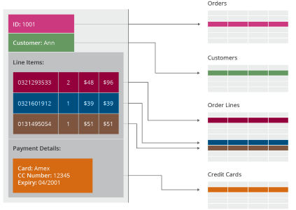
</p>

- Apesar de grandes vantagens, os RDBMSs não são perfeitos
- Desenvolvedores frustram-se pelo **descompasso de impedância**, que é a
  **"diferença entre o modelo relacional e as estruturas de dados na memória"**

---
# <span style="font-family: Bangers;color:black;">O Ataque dos _Clusters_</span>

- Para lidar com **o aumento de tráfego e dados**, pode-se melhorar a infra-estrutura de _hardware_ usando:
  - Abordagem **vertical**: servidores mais potentes, mais processadores, discos e memória
    - Preços aumentam mais rapidamente quanto mais alto é a demanda
    - Limites reais (físicos)
- Abordagem **horizontal**: dividir os dados em diversos computadores (_culsters_) mais simples
    - **Mais barato**, porque pode-se usar _commodity hardware_
    - Mais sucetível a erro na individualidade, porém muito **mais confiável** em conjunto
    - Virtualmente **sem limites de expansão**

---
## <span style="font-family: Bangers;color:black;">Adoção de _clusters_</span>

- Grandes empresas começaram a preferir a abordagem horizontal
  - Problema: **bancos relacionais não foram projetados para _clusters_**
    - Oracle RAC e Microsoft SQL Server usam um **subsistema de disco compartilhado**
      - Contudo, dependem dele como **único ponto de falha**
    - É  possível separar servidores para conjuntos diferentes dos dados (técnica de _sharding_)
      - A aplicação precisa saber em qual servidor cada conjunto de dados está
      - Perde-se: consultas, integridade referencial, transações entre _shards_
      - Problema de licensiamento: os bancos relacionais tipicamente vendiam a licença para apenas 1 servidor

---
## <span style="font-family: Bangers;color:black;">Google e Amazon</span>

- O descompasso entre bancos relacionais e _clusters_ levaram empresas a repensar seu armazenamento de dados
- Google e Amazon já usavam _clusters_ e ambas possuíam um volume imenso de dados e bastante dinheiro ;)
- Resultados:
  - Google propôs o [BigTable, 2006](http://static.googleusercontent.com/media/research.google.com/pt-BR//archive/bigtable-osdi06.pdf)
  - Amazon propôs o [Dynamo, 2007](http://www.allthingsdistributed.com/files/amazon-dynamo-sosp2007.pdf)

---
# <span style="font-family: Bangers;color:black;">O Surgimento do NoSQL</span>

- Em 1998, Carlo Strozzi criou um banco de dados relacional de código aberto, mas que não usava SQL
  - Mas isso não tem a ver com nossa aula ;)
- Johan Oskarsson organizou uma [_meetup_](http://www.meetup.com/) para discutir sobre bancos de dados alternativos
  - BigTable e Dynamo haviam inspirado pessoas e organizações a criar bancos para escalar horizontalmente
  - Johan precisava de um nome (algo que desse **uma boa _#hashtag_**)
    - Em um chat, sugeriram (Eric Evans) **NoSQL** e o nome "pegou"

---
## <span style="font-family: Bangers;color:black;">O Surgimento do NoSQL</span>

- Interpretações do nome
  - NoSQL -&gt; ~~Sem SQL~~
  - NoSQL -&gt; ~~Não apenas SQL~~
- Melhor **enxergar NoSQL como um movimento** do que uma tecnologia
- A ideia é ter mais uma ferramenta na caixa
  - Este ponto de vista é chamado de **persistência poliglota**

---
<!--
  backdrop: chapter
-->

# Modelos de dados **não-relacionais**

---
## Introdução

- <p class="note" style="float:right;width: 40%;">Um **modelo de dados** é a forma como **vemos
e manipulamos nossos dados**</p>
  Modelo de dados é diferente de modelo de armazenamento
  - O modelo relacional usa **relações (tabelas) e tuplas (linhas/registros)**
  - Modelos NoSQL são divididos em 4 grandes tipos:
    1. _key-value_ (chave-valor)
    1. _documents_ (documentos)
    1. _column-family_ (famílias de colunas)
    1. _graph_ (grafo)
  - Os 3 primeiros têm uma característica em comum: são **orientados a
    agregados**
    - Vamos ver o que isso significa... mas primeiro, o que o
      <span style="font-family: Ravie; color: gray;">cachorritos</span> tem
      a dizer sobre tudo isso?

---
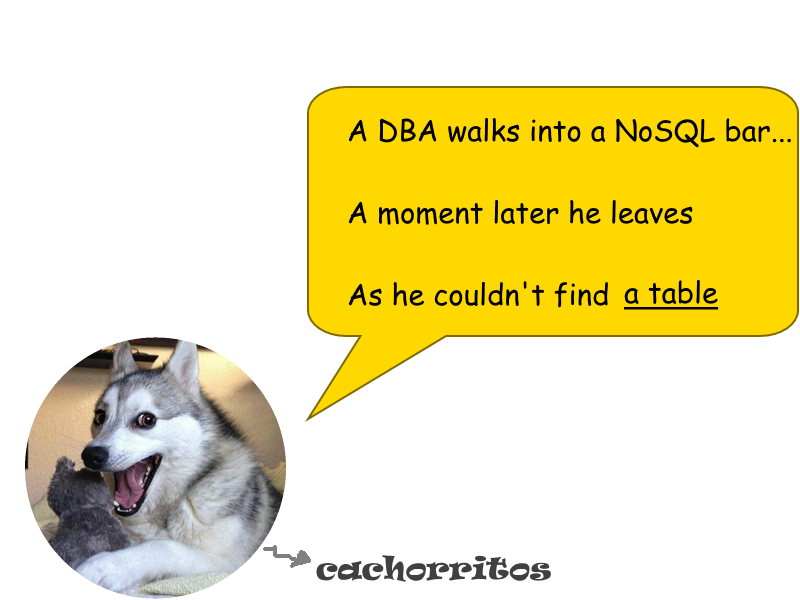

---
## Um agregado

- Às vezes (_e.g._ quando programamos) é mais fácil pensar e usar registros
  mais complexos que uma tupla - que permitam listas e aninhamento

<p class="note" style="width: 70%;">Um **agregado** é uma **coleção de objetos**
relacionados que queremos **tratar de forma unitária**</p>

- Em particular:
  1. **Operações atômicas** são realizadas por agregado (ACID)
  1. O banco matém **consistência no nível dos agregados**
  1. **Comunicamos com o banco** usando agregados

---

<div class="layout-split-2">
  <section style="border-right: 4px dotted silver;" class="bullet">
    <h2>Tupla</h2>
    
  </section>
  <section class="bullet">
    <h2>Agregado</h2>
<pre>
<code class="hljs lang-json" style="text-align: left;">
{
  "id": 1,
  "name": "Martin",
  "billingAddress": ["Chicago"]
}
</code>
</pre>
  </section>
</div>

---
# Principais **modelos de Dados NoSQL**

<figure style="position: relative;width:100%;height:260px;">
  
  
</figure>

- [Lista curada](http://nosql-database.org/) de bancos NoSQL (150 _and counting_ :)

---
<!--
  classes: no-bullet
-->

## Tipo: **_Key-Value_**

- 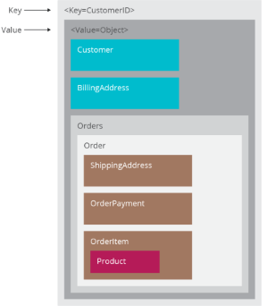
  Basicamente armazena qualquer coisa a partir de uma chave.
- Completamente sem _Schema_ (_schemaless_)
- Operações básicas
  - `Get, Set, Delete`
- Outras operações específicas por implementação

---
## Tipo: **_Document_**

- 
  _Key-Value_ com um pouco mais de estrutura
- Valor armazenado utiliza formatos como `XML, JSON, BSON`
- Estrutura de documentos flexíveis.
- Consultas por campos dos documentos.
- Inserção de documentos e atualização de campos

---
## Tipo: ** _Column-family_**


- Não considere como uma tabela, mas como um mapa de 2 níveis
  - 2 chaves: identificador de linhas, id. de coluna
- Em vez de armazenar cada _row_ contígua, armazena um conjunto de colunas das
  _rows_

---
<!--
  backdrop: white
-->


```js
get('1234', 'name');
```

---
## Tipo: **_Graph_**

- Um peixe fora d'água no laguinho NoSQL
- Mas os banco relacionais não são feitos de relacionamentos?
  - Custoso (`JOIN` é uma operação cara)
  - Inserções comprometidas
  - Buscas complexas
- Dados simples (pequenos), mas muitas ligações entre eles

---


---
<!--
  backdrop: chapter
-->

# Modelos de Distribuição

---
## Modelos de Distribuição

- Já discutimos as vantagens de se escalar verticalmente _vs._ horizontalmente
  - Horizontalmente é mais atrativo porque podemos ter os bancos de dados em
    _clusters_
  - Dependendo do modelo de distribuição, o banco pode proporcionar habilidade
    de:
    1. Lidar com grandes volumes de dados
    1. Processar tráfego de leitura/escrita maior
    1. Ter melhor disponibilidade em caso de problemas na rede

---
## Modelos de Distribuição

- Os benefícios são importantes e muito bons, mas eles têm seu preço:
  - Executar **sistemas em _clusters_ introduz complexidade**
- Há duas abordagens para distribuição de trabalho:
  1. **Replicação**
    - Uma cópia dos dados em cada nó
  1. **_Sharding_** ("Estilhaçamento" dos dados)
    - Dados diferentes em cada nó
- Vejamos algumas configurações possíveis desses modelos

---
## Modelo: **Servidor Único**

- A primeira e mais simples forma de distribuição
  - Consiste em ter o **banco de dados em apenas um computador**
- Faz sentido usar um banco NoSQL em um único servidor:
  - Já que o modelo agregado está mais próximo do modelo de dados
    da aplicação
  - Bancos de dados NoSQL de grafos não são apropriados para _clusters_
- Se o uso dos dados é bem voltado à manipulação de agregados, um _key-value_
  ou um _document store_ pode ter melhor desempenho do que um banco relacional

---
## Modelo: **_Sharding_**

- Frequentemente, um banco fica ocupado porque **pessoas diferentes estão acessando
  partes diferentes dos dados**
- Nesse caso, pode-se escalar horizontalmente ao colocar partes diferentes dos
  dados em servidores diferentes (_sharding_)
- O conceito de _sharding_ não é novidade do NoSQL - já existia antes
  - Contudo, era controlado pela aplicação e não pelo próprio banco
- Consistia em (_e.g._) colocar todos os clientes cujo nome começa com A-D
  em um _shard_, E-G em outro...

---
## _Sharding_: Abordagens

- Para tentar aproximar do caso ideal, precisamos garantir que dados acessados
  em conjunto (`JOIN`) fiquem armazenados no mesmo nó
  - Isso é muito simples usando agregados
    - **Agregados formam uma unidade natural para ser distribuída**
- Em geral, muitos bancos NoSQL oferecem _auto-sharding_
- Isso torna muito mais fácil usar essa técnica de distribuição em uma aplicação
- _Sharding_ melhora muito o desempenho porque **melhora os tempos de leitura e
  escrita**
  - Já que **cada nó é responsável tanto pela escrita quando pela leitura
    de seus agregados**

---
# Replicação

---
## Replicação **_Master-Slave_**

- Nesta configuração, um nó é designado como _master_ (primário) e os outros
  como _slaves_ (secundários)
  - O **_master_** é a fonte autoritativa dos dados e o **único que pode escrever**
  - Os **_slaves_** são usados apenas **para leitura**
- Um **processo de replicação sincroniza os dados** dos _slaves_ com os
  do _master_
- É **útil quando** se tem um _dataset_ em que se faz **muita leitura**, mas
  pouca escrita

---
## Replicação _Master-Slave_ (2)

- Escala-se horizontalmente ao adicionar mais _slaves_
  - Contudo, ainda estamos **limitados à capacidade do único _master_** de
    **processar escritas**
- Um benefício é a **resiliência de leitura**:
  - Se o _master_ falha, ainda é possível ler dos _slaves_
  - Mas escritas só estarão disponíveis quando o _master_ for restaurado

---
## Replicação _Master-Slave_ (3)

- Replicação _master-slave_ introduz a **possibilidade de problemas de
  consistência**
  - Aplicações lendo de _slaves_ podem receber dados ainda não atualizados

---
## Replicação **_Peer-to-Peer_**

- **Replicação _master-slave_** nos dá **escalabilidade horizontal de
  leitura**, mas não da escrita dos dados
  - Além disso, **há resiliência da leitura**, mas **não da escrita**
  - O **_master_** ainda é um **ponto único de falha**
- **_Peer-to-Peer_** resolve esses problemas ao **não ter um nó _master_**

---
## Replicação **_Peer-to-Peer_** (2)

- Todas as réplicas são idênticas (aceitam escrita e leitura)
- Com _peer-to-peer_, podemos ter falhas nos nós sem perder a capacidade de
  escrita, nem perder dados


---
## Replicação **_Peer-to-Peer_** (3)

- Adicionar novos nós para escalar horizontalmente é simples
- O custo disso é cobrado na consistência
- Ao podermos escrever em qualquer nó, aumentamos a possibilidade de gerar
  inconsistências na escrita
  - _E.g._, dois+ clientes reservando o mesmo quarto de hotel
  - Contudo, é possível mitigar esse problema

---
## Usando **_Sharding_ + Replicação**

- _Master-slave_ + _Sharding_: múltiplos _masters_, mas **cada item tem
  apenas 1 master**
  - Um nó pode ser _master_ para um dataset e _slave_ para outro
- _Peer-to-peer_ + _Sharding_: cada dataset está presente (tipicamente)
  em 3 nós replicados
  - O **fator de replicação** 3 é normalmente usado

---
<!--
  backdrop: mongodb-forest
-->

# 

---
## Por que o MongoDB?


[https://www.google.com/trends/explore#q=MongoDB...](https://www.google.com/trends/explore#q=MongoDB%2C%20CouchDB%2C%20RethinkDB%2C%20RavenDB&cmpt=q&tz=Etc%2FGMT%2B2)
---
## 

<p class="note" style="width: 90%;">
  _“MongoDB” derives from the word **“humongous”** because of its ability to
  scale up with ease and hold very large amounts of data._
</p>

- Dados possuem formato flexível
- Nossa interface com o banco é feita por documentos no formato
  <abbr title="JavaScript Object Notation">`JSON`</abbr>, mas
  são armazenados em <abbr title="Binary JSON">`BSON`</abbr>
  - `BSON` ocupa bem menos espaço
  - `BSON` possui bem mais tipos de dados do que `JSON`
- Relações podem ser representadas como referências ou como documentos
  aninhados (embutidos)
- _Whitepaper_ da [Arquitetura do MongoDB](http://s3.amazonaws.com/info-mongodb-com/MongoDB_Architecture_Guide.pdf)

---
## Por onde começar (1)


- [Site do MongoDB - _open-source_](https://www.mongodb.org/)
- [Site da empresa do MongoDB ](https://www.mongodb.com/)

---
## Por onde começar (2)


- [Universidade MongoDB](https://university.mongodb.com)
  1. MongoDB para desenvolvedores (Java, .NET...)
  1. MongoDB para DBAs, etc.

---
## JSON e BSON

- `JSON` é um [formato aberto](http://json.org/) para representação de dados,
  **fácil para pessoas e máquinas lerem**
  - 
    Criado por Douglas Crockford, Engenheiro da YAHOO
- Pode ser usado pelo mesmo objetivo que o `XML`: **interoperabilidade de
  dados**
- Possui alguns tipos de dados:
  1. Números (_double_ de 64 bits)
  1. _Strings_ (texto)
  1. Valores _Boolean_ (`true`/`false`)
  1. _Arrays_
  1. Objetos (estilo tabelas _hash_)

---
## Exemplo de um Objeto em JSON

- Arquivo `celebridade_da_computacao.json`
  ```json
  {
    "_id" : 1,
    "nome" : { "primeiro" : "John", "ultimo" : "Backus" },
    "contribs" : [ "Fortran", "ALGOL", "Backus-Naur Form" ],
    "premio" : [
      {
        "nome" : "W.W. McDowell Award",
        "ano" : 1967,
        "entregue_por" : "IEEE Computer Society"
      }
    ]
  }
  ```

---
## Formato **JSON para Armazenar**

- Não é a melhor ideia, visto que:
  - O formato `JSON` não tem um tipo:
    1. Para data/_timestamp_
    1. Para diferenciar números inteiros/reais, 32/64bits
    1. Para representar um campo binário (_e.g._, imagem)
  - Ele é textual, então ocupa mais espaço em disco do que se fosse binário

---
## Formato **BSON**

- Os criadores do MongoDB propuseram, então, o
  **[_Binary `JSON`_](http://bsonspec.org/)**, que o **`JSON` atendesse a
  demanda de armazenamento**

  
  - Além dos tipos mencionados, há também o tipo `ObjectId`

---
## Documentos: **_ObjectId_**

- O `ObjectId` é um tipo de dados `BSON` usado como chave dos documentos
  - Ele tem 12 _bytes_ e é construído por:
    
  - A ideia é que o `ObjectId` de cada documento seja único na coleção
  - **Todo documento recebe um campo `_id`**, com um valor de `ObjectId` único
    gerado pelo banco
    - Contudo também podemos passar um valor único nosso para `_id`

---
## Ferramentas

|                   | MongoDB          | MySQL  | Oracle  | Informix  | DB2        |
|-------------------|------------------|--------|---------|-----------|------------|
| Servidor do Banco | [mongod][mongod] | mysqld | oracle  | IDS       | DB2 Server |
| Cliente           | [mongo][mongo]   | mysql  | sqlplus | DB-Access | DB2 Client |

- Além de `mongod` e `mongo`, há diversas ferramentas auxiliares. Algumas são:
  - `mongoimport`, `mongoexport`
  - [Robomongo](http://robomongo.org/) (_3rd-party_)
  - [E outras várias ferramentas administrativas](http://docs.mongodb.org/ecosystem/tools/administration-interfaces/) não oficiais

[mongo]:http://docs.mongodb.org/manual/reference/program/mongo/#bin.mongo
[mongod]: http://docs.mongodb.org/manual/reference/program/mongod/#bin.mongod


---
<!--
  backdrop: emphatic
-->

# DQL, DML e DDL

---
## **Consultas**

- Todas as consultas são feitas usando o método `db.collection.find()`
  - Recebe os **critérios**, **projeção** e retorna um **cursor**
- Todas as consultas **operam em uma <u>única coleção</u>**
- Consulta em MongoDB:
  
- Em um banco relacional:
  

---
## <abbr title="Data Query Language">D**Q**L</abbr>: **Consultas**

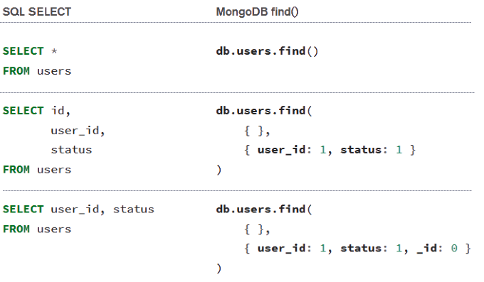

---
## <abbr title="Data Query Language">DQL</abbr>: Consultas - **WHERE**

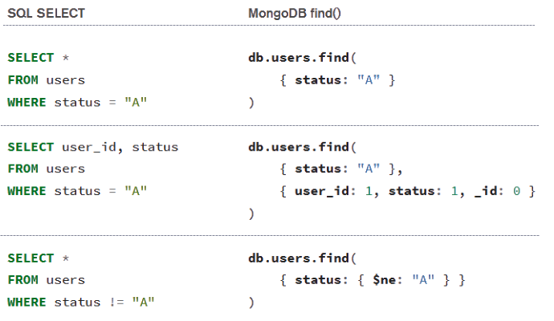

---
## <abbr title="Data Query Language">DQL</abbr>: Consultas - WHERE (2)


---
## <abbr title="Data Query Language">DQL</abbr>: Consultas - **Regex**

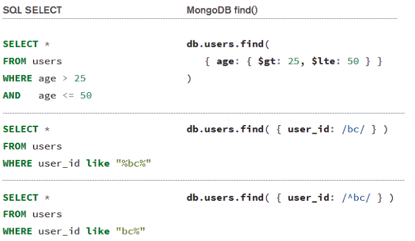

---
## <abbr title="Data Query Language">DQL</abbr>: Consultas - **Ordenando**


---
## <abbr title="Data Query Language">DQL</abbr>: Consultas - **Contando**

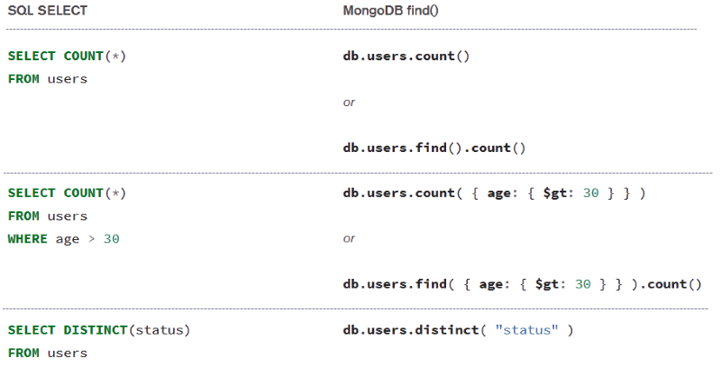

---
## <abbr title="Data Query Language">DQL</abbr>: Consultas - **_Limit_ e _Skip_**


---
## <abbr title="Data Definition Language">D**D**L</abbr>: **Criar**

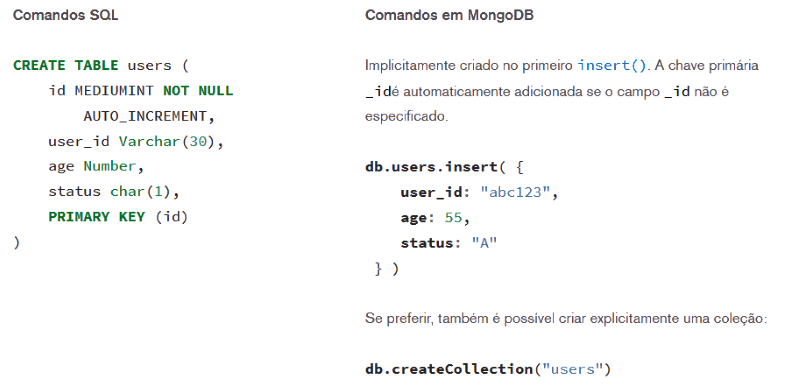

---
## <abbr title="Data Definition Language">DDL</abbr>: Alterar (**novo campo**)


---
## <abbr title="Data Definition Language">DDL</abbr>: Alterar (**remover campo**)


---
## <abbr title="Data Manipulation Language">D**M**L</abbr>: **Inserção**


---
## <abbr title="Data Manipulation Language">DML</abbr>: **Atualização**


---
## <abbr title="Data Manipulation Language">DML</abbr>: **Exclusão**


---
<!--
  backdrop: emphatic
-->

# Modelando os Dados

---
## Modelagem

- Dados no MongoDB possuem _schema_ flexível (_schemaless_)
  - Coleções não forçam a estrutura de seus documentos
  - Isso reduz o descompasso de impedância
- O desafio é modelar os dados de forma a atender:
  1. **A demanda da aplicação** (que tipos de uso dos dados serão feitos)
  1. As características de desempenho do MongoDB
  1. Os padrões de recuperação dos dados (relatórios)
- A principal decisão é sobre a **estrutura dos documentos**:
  1. **Referências** entre documentos
  1. Documentos **embutidos**

---
## Documentos: Estrutura com **Referências**

- Estrutura normalizada
- Referências armazenam relacionamentos entre documentos
- **Aplicações** podem usá-las para acessar dados relacionados


---
## Documentos: Estrutura **Embutida**

- Estrutura desnormalizada
- Capturam os relacionamentos ao armazenar objetos aninhados
- Torna o _sharding_ possível/eficiente

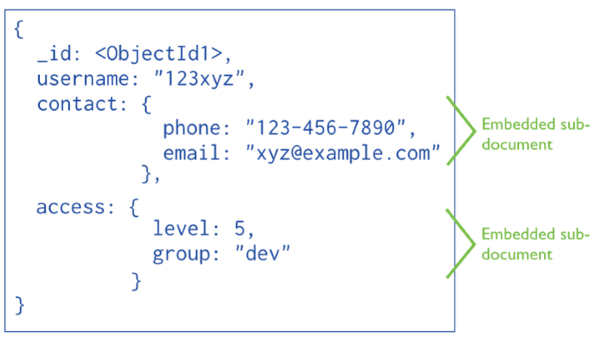

---
## Documentos: Operações de Escrita

- Escritas são **atômicas no nível de um documento**
- Um modelo de dados desnormalizado facilita as escritas atômicas
- Normalizar os dados em várias coleções pode requerer múltiplas operações
  de escrita que não são atômicas
  - Aumento no risco de inconsistência

---
## Critérios para escolher a estrutura

<div class="layout-split-2" style="height: auto;">
  <section style="border-right: 4px dotted silver;">
    <h3><u>Embutidos</u></h3>
    <ul style="text-align: left;">
      <li>Usar quando:
        <ul>
          <li>Há relações de "contém" entre entidades (_one-to-one_)</li>
          <li>Há relações de um-pra-muitos entre entidades</li>
        </ul>
      </li>
      <li>**Desempenho para leitura** (muito) melhor </li>
      <li>É possível **alterar** dados de forma **atômica**</li>
      <li>Requer **mais espaço**</li>
      <li>Pode causar **incosistência**</li>
    </ul>
  </section>
  <section>
    <h3><u>Referências</u></h3>
    <ul style="text-align: left;">
      <li>Usar quando:
        <ul>
          <li>Embutir resultaria em duplicação mas pouco ganho de desempenho</li>
          <li>Representar relacionamentos mais complexos (_many-to-many_)</li>
          <li>Modelar grandes _datasets_ hierárquicos</li>
        </ul>
      </li>
      <li>Mais flexibilidade</li>
      <li>Menos espaço para armazenar</li>
      <li>Desempenho menor</li>
    </ul>
  </section>
</div>

---
## Modelando para **Atomicidade** (1/2)

- Caso: manter informação sobre livros, inclusive **cópias disponíveis** e
  **cópias em processo de venda**:
  ```js
  {
      _id: 123456789,
      title: "MongoDB: The Definitive Guide",
      author: [ "Kristina Chodorow", "Mike Dirolf" ],
      published_date: ISODate("2010-09-24"),
      pages: 216,
      language: "English",
      publisher_id: "oreilly",
      available: 3,
      checkout: [ { by: "joe", date: ISODate("2012-10-15") } ]
  }
  ```

---
## Modelando para **Atomicidade** (2/2)

- Quando uma cópia do livro é colocada no carrinho, devemos atualizar o
  documento de forma atômica:
  ```js
  db.books.update (
     { _id: 123456789, available: { $gt: 0 } },
     {
       $inc: { available: -1 },
       $push: { checkout: { by: "abc", date: new Date() } }
     }
  )
  ```

---
## Voltando às **consultas** (1/2)...

- Considere uma coleção `inventory` com documentos semelhantes a:
  ```js
  {
    item: "Screwdriver",
    producer: {
       company: "Philips",
       address: "Amsterdan"
    },
    stock: [ { size: "S", qty: 25 }, { size: "M", qty: 50 } ],
    category: "tools"
  }
  ```
- Para consultar **campos de documentos embutidos**, usamos a
  **_dot notation_**

---
## Voltando às **consultas** (2/2)...

- Um _match_ exato:
  ```js
  db.inventory.find({ producer: {company: 'ABC', address: '123' }})
  ```
- Campos individuais:
  ```js
  db.inventory.find({ 'person.company': 'ABC' });
  ```
- Elemento específico de um _array_:
  ```js
  db.inventory.find({ 'favorite_fruits.0': 'Apple' });
  ```
- [Referência](http://docs.mongodb.org/manual/tutorial/query-documents/)
  completa na documentação do MongoDB

---
## **Índices**

- Índices possibilitam o **uso eficiente de consultas** no MongoDB
- São usados para **limitar o número de documentos a serem procurados**
  - _collection scan_ _vs_ _index lookup_
- Por padrão, o MongoDB cria um índice para o campo _\_id_
- Índices são criados usando árvores B e armazenam os dados dos campos
  ordenados pelos valores

---
## Índices (2)

- Cada nó da árvore possui um valor do campo do índice
- As folhas são apontadores para os documentos da coleção


---
## **Tipos de Índices**

- **Índice padrão**: no campo `_id`
- **Índice de um único campo**: apenas um campo ;)
- **Índice composto**: múltiplos campos fazem parte do índice
- **Índice multi-chave**: quando o índice é criado em um campo que é um _array_
- **Índice geoespacial**:
  - `2d` para estruturas planares e
  - `2sphere` para geometria esférica
- **Índice textual**: faz _tokenization_, remoção de _stopwords_ e _stemming_
- **Índice _hash_**:
  - Usado para se fazer _sharding_
  - Suporta apenas comparador de igualdade  

---
## Criando Índices

- Coleção `friends`:
  ```js
  {
    _id: ObjectId(...),
    name: "Alice",
    age: 27,
    profession: "Programmer"
  }
  ```
- Criando um índice de campo único para `profession`
  ```js
  db.friends.createIndex({ profession: 1 });
  ```

---
## Plano de Execução ([referência](http://docs.mongodb.org/manual/reference/explain-results/))

- Para **ver um índice em ação**, podemos pedir ao MongoDB para **mostrar
  o plano de execução** usando **`cursor.explain()`**:
  ```js
  db.inventory.find({ type: 'food'}).explain();
  ```
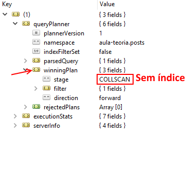


---
<!--
  backdrop: emphatic
-->

# Replicação e _Sharding_

---
## Replicação (1/2)

- 
  Replicação no MongoDB é feita no modelo _master-slave_
  - O termo adotado é **primário-secundário**
- Um conjunto de réplicas é um grupo de instâncias de `mongod` que
  armazenam o mesmo _dataset_
- O `mongod` **primário recebe todas** solicitações de **escrita**
- Os `mongod` **secundários sincronizam com o primário** e <u>podem*</u> recebem
  solicitações de **leitura**
  - * não é o comportamento padrão
  - Se o primário falha, os secundários auto-elegem um novo primário

---
## Replicação (2/2)

- No MongoDB, replicação é muito mais uma forma de manter resiliência do que
  de melhorar a performance de leitura e escrita (_availability_)
  - Lendo/escrevendo no master, atinge-se **consistência forte** sempre
  - Ao usar os secundários, temos **consistência fraca** ou **eventual**
    - (+) Aumenta a disponibilidade
    - (+) Pode reduzir a latência (_e.g._, localidade geográfica)
    - (+) Tolerância a falhas na rede (para leitura)

---
## _Sharding_ (1)

- 
  No MongoDB, escala-se horizontalmente **dividindo-se os dados em _shards_**
  - Cada _shard_ é um banco independente e, **coletivamente, eles formam um
    único banco de dados lógico**
- Benefícios:
  - (+) reduz o número de operações cada _shard_
  - (+) reduz a quantidade de dados em cada _shard_

---
## _Sharding_ (2)

- 
  **_shard_**: armazena uma parcela dos dados
  - Para ter alta disponibilidade e consistência, cada _shard_ deve ser uma
    _replica set_
- **_query router_**: uma instância de `mongos`
  - Direciona as operações para os _shards_ apropriados
  - Pode existir mais de 1 _router_ para dividir a carga
- **_config server_**: armazena a configuração do _cluster_
  - Contém um mapeamento dos dados para _shards_
  - O _router_ usa esses dados

---
## _Sharding_: **Particionando os dados**

- Dados são **particionados no nível da coleção**
- Para fazer _sharding_ em uma coleção, uma **<u>_shard key_</u>** deve ser
  escolhida, que pode ser:
  - Um campo indexado
  - Campos que formam um índice composto
- O MongoDB **divide os valores da _shard key_ em grandes _chunks_** e os
  distribui de forma equilibrada entre os _shards_
- Para saber em qual _chunk_ vai cada _shard key_, o MongoDB usa:
  1. _Sharding_ baseado em **intervalo**
  1. _Sharding_ baseado em **_hash_**

---
## Como distribuir _shard keys_ em _chunks_

- _Sharding_ baseado em **intervalo**:
  

- _Sharding_ baseado em **_hash_**:
  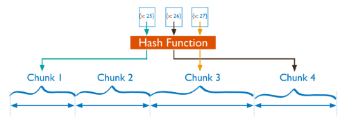

---
<!--
  backdrop: chapter
-->

# Consistência e Teorema CAP
---
## Afrouxando **Consistência**

- Consistência é lindo. Podemos tentar maximizá-la em um sistema, mas
  inevitavelmente sacrificaremos outras características do sistema
  - _e.g._, uma abordagem pessimista trancando os dados
- O teorema CAP (Brewer 2000) afirma que se há uma partição na rede, você
  precisa trocar disponibilidade dos dados por consistência (ou vice-versa)
  - **Disponibilidade** (_availability_): poder ler e escrever em um nó do
    _cluster_
  - **Tolerância ao Particionamento** (_partition tolerance_): _cluster_
    sobrevive ao rompimento na comunicação dos nós

---
<!--
  backdrop: black
  classes: full-image-slide
-->


---
## Tolerância a falhas na rede

- 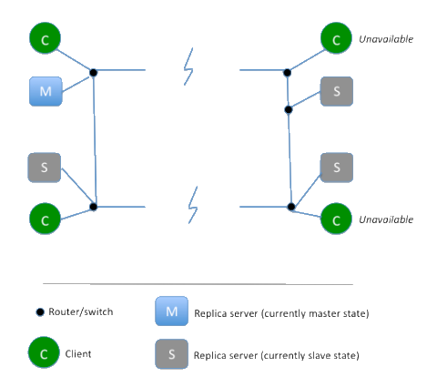
  Em caso de partição na rede, podemos tomar uma destas ações:
  1. Proibir quaisquer escritas
  2. Permitir escritas de um lado (que tem o _master_)
  3. Permitir leitura e escrita em qualquer canto, mas lidar com conflitos

---
## Afrouxando **Consistência** (2)

- Em alguns casos, **não é tão problemático** ter **baixa consistência para ter
  alta disponibilidade**
  - Exemplo: **carrinho de compra** (DynamoDB da Amazon):
    - Cliente sempre pode colocar produtos ao carrinho (_availability_)
    - Problemas na rede podem gerar múltiplis carrinhos por cliente
    - No processo de fechamento, carrinho é mesclado e cliente pode revisá-lo
  - Exemplo: **hotel** permitir _overbooking_

---
# Referências

- Livro _"NoSQL Distilled"_
  - Capítulo 1: _Why NoSQL?_
  - Capítulo 2: _Aggregate Data Models_
  - Capítulo 3: _More Details on Data Models_
  - Capítulo 4: _Distribution Models_
  - Capítulo 5: _Consistency_
  - Capítulo 8: _Document Stores_
- [Manual do MongoDB](http://docs.mongodb.org/manual/core/) (3.0)
